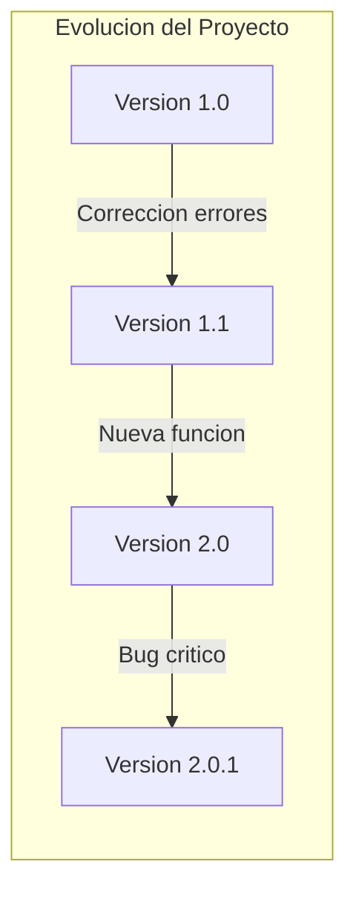
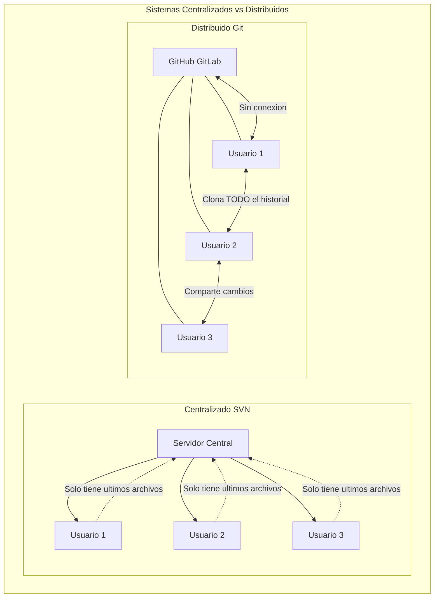
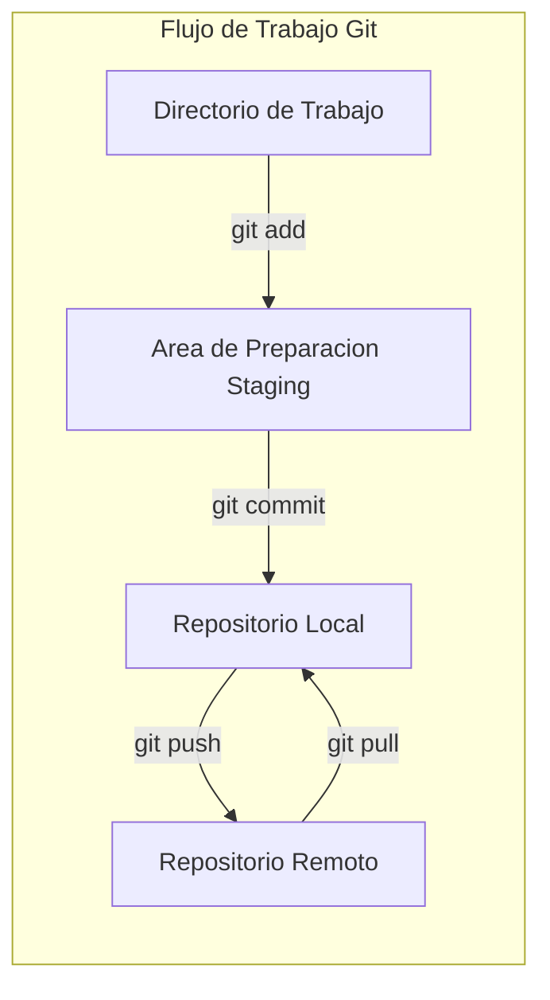
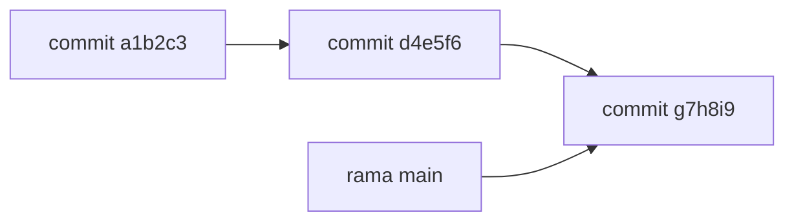
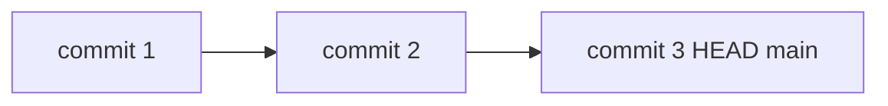
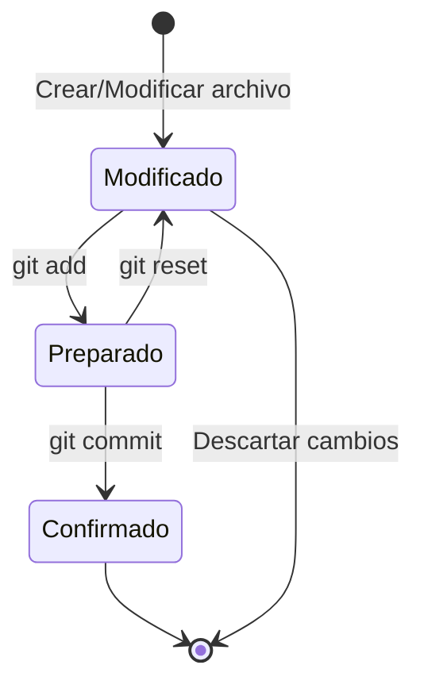

- [1. Introducción a Git y Control de Versiones](#1-introducción-a-git-y-control-de-versiones)
  - [1.1. ¿Qué es el Control de Versiones?](#11-qué-es-el-control-de-versiones)
  - [1.2. Introducción a Git](#12-introducción-a-git)
    - [1.2.1. ¿Qué hace especial a Git?](#121-qué-hace-especial-a-git)
    - [1.2.2. Ventajas del Modelo Distribuido](#122-ventajas-del-modelo-distribuido)
    - [1.2.3. El Flujo de Trabajo Git](#123-el-flujo-de-trabajo-git)
  - [1.3. Conceptos Clave en Git](#13-conceptos-clave-en-git)
    - [1.3.1. Repositorio (Repository)](#131-repositorio-repository)
    - [1.3.2. Commit (Confirmación)](#132-commit-confirmación)
    - [1.3.3. Rama (Branch)](#133-rama-branch)
    - [1.3.4. Área de Preparación (Staging Area / Index)](#134-área-de-preparación-staging-area--index)
    - [1.3.5. Directorio de Trabajo (Working Directory)](#135-directorio-de-trabajo-working-directory)
    - [1.3.6. HEAD](#136-head)
  - [1.4. El Ciclo de Vida de los Archivos en Git](#14-el-ciclo-de-vida-de-los-archivos-en-git)
    - [Pasos del Ciclo:](#pasos-del-ciclo)
    - [Los Tres Estados de un Archivo:](#los-tres-estados-de-un-archivo)

# 1. Introducción a Git y Control de Versiones

En este módulo aprenderás los fundamentos del control de versiones con Git y GitHub, pilares esenciales para la eficiencia, calidad y colaboración en el desarrollo de software.

---

## 1.1. ¿Qué es el Control de Versiones?

El **control de versiones** es un sistema que registra los cambios realizados en un archivo o conjunto de archivos a lo largo del tiempo. Su propósito principal es permitir a los desarrolladores recuperar versiones específicas de sus proyectos en cualquier momento.

> 📝 **Nota del Profesor:** "El control de versiones es como un 'guardar partida' avanzado. Cada commit es un punto de restauración. Si mañana descubres que tu código tiene un error, puedes volver a cualquier versión anterior en segundos."

**Beneficios del Control de Versiones:**

- **Recuperación**: Puedes volver a cualquier versión anterior
- **Historial completo**: Cada cambio queda registrado con autor, fecha y razón
- **Colaboración**: Múltiples desarrolladores pueden trabajar simultáneamente
- **Trazabilidad**: Saber quién hizo qué cambio y por qué

> 💡 **Tip del Examinador:** Pregunta tipica: "¿Cuales son los tres objetivos principales del control de versiones?"
> **Respuesta:** Recuperar versiones anteriores, coordinar trabajo en equipo, y mantener historial de cambios.

---

## 1.2. Introducción a Git

**Git** es un *software* de control de versiones distribuido, diseñado por Linus Torvalds en 2005 para gestionar el desarrollo del núcleo Linux.

### 1.2.1. ¿Qué hace especial a Git?

A diferencia de los sistemas centralizados (como Subversion), Git otorga a cada desarrollador una **copia local completa del historial** del proyecto.

> 📝 **Analogía del distribuidor:** "Imagina que en lugar de ir a una biblioteca central a consultar un libro (sistema centralizado), cada usuario tiene una fotocopia completa de toda la biblioteca en su casa. Puede leer, estudiar y hasta hacer anotaciones sin ir a la biblioteca central. Cuando quiere compartir sus cambios, los envía a la biblioteca central y viceversa. Eso es Git: cada desarrollador tiene todo el historial."

### 1.2.2. Ventajas del Modelo Distribuido

| Característica | Sistema Centralizado | Git Distribuido |
|----------------|---------------------|-----------------|
| **Velocidad** | Limitada por red | Instantánea (todo local) |
| **Trabajo offline** | Imposible | Totalmente posible |
| **Copia de seguridad** | Solo servidor | Cada cliente es backup |
| **Colaboración** | Solo con servidor | P2P entre desarrolladores |

### 1.2.3. El Flujo de Trabajo Git

> 💡 **Tip del Examinador:** Pregunta tipica: "¿Cuales son los tres estados de un archivo en Git?"
> **Respuesta:** Modificado Working Directory, Preparado Staging Area, y Confirmado Repository.

---

## 1.3. Conceptos Clave en Git

Para comprender Git, es fundamental familiarizarse con estos conceptos:

### 1.3.1. Repositorio (Repository)

Es el corazón del proyecto. Un repositorio es el lugar donde se almacenan todos los datos actualizados y el historial completo de cambios de un proyecto.

- Contiene todas las versiones previas
- Incluye ramas y etiquetas
- Cuando clonas, obtienes TODO el historial

### 1.3.2. Commit (Confirmación)

Un `commit` es un punto de control en el proceso de desarrollo. Es una "instantánea" de tu proyecto en un momento específico.

- Identificado por un código hash SHA-1 de 40 caracteres
- Incluye metadatos: autor, fecha, mensaje
- Los mensajes deben ser claros y concisos (menos de 50 caracteres en primera línea)

### 1.3.3. Rama (Branch)

Las ramas representan líneas de desarrollo independientes.

- Una rama es un simple puntero a un commit específico
- Crear y destruir ramas es extremadamente rápido en Git
- Permite trabajar en funcionalidades sin afectar el código principal

> 📝 **Truco visual:** "Una rama en Git es como una vía de tren. Puedes tener varias vías (ramas) donde los trenes (commits) circulan independientemente. Cuando terminas, puedes unir las vías (merge)."

### 1.3.4. Área de Preparación (Staging Area / Index)

Es una zona intermedia donde se seleccionan los cambios que se incluirán en el próximo `commit`.

- Permite construir commits precisos
- Elige exactamente qué cambios guardarán
- Archivos "preparados" están listos para confirmar

### 1.3.5. Directorio de Trabajo (Working Directory)

Es la copia de los archivos del proyecto en tu máquina local.

- Aquí realizas las modificaciones directamente
- Los archivos se extraen de la base de datos Git
- Si un archivo ha cambiado pero no está preparado, está "modificado"

### 1.3.6. HEAD

Es un puntero a la referencia de rama actual, que a su vez es un puntero al último `commit` realizado.

> 📝 **Truco visual:** "Piensa en HEAD como el indicador de página de un libro. Siempre está en la página que estás leyendo (el commit actual). Cuando avanzas página (haces commit), el indicador se mueve."

---

## 1.4. El Ciclo de Vida de los Archivos en Git

El flujo de trabajo básico en Git sigue una secuencia lógica:

### Pasos del Ciclo:

1. **Modificar archivos**: Realizas cambios en tu directorio de trabajo
2. **Preparar archivos**: Añades los cambios al área de preparación con `git add`
3. **Confirmar cambios**: Ejecutas `git commit` para guardar la instantánea

### Los Tres Estados de un Archivo:

| Estado | Descripción | Comando para avanzar |
|--------|-------------|---------------------|
| **Modificado** | Has cambiado el archivo, pero no lo has preparado | `git add` |
| **Preparado** | Has marcado el archivo modificado para el próximo commit | `git commit` |
| **Confirmado** | Los datos están seguros en tu repositorio local | - |

> 💡 **Regla nemotécnica:** "Los archivos van de Modificado → Preparado → Confirmado. Como subir una escalera: cada paso es más alto (más seguro)."
