- [2. Git Básico: Comandos Esenciales](#2-git-básico-comandos-esenciales)
  - [2.1. Configuración Inicial](#21-configuración-inicial)
    - [git config](#git-config)
  - [2.2. Creación y Clonación de Repositorios](#22-creación-y-clonación-de-repositorios)
    - [git init vs git clone](#git-init-vs-git-clone)
    - [git init](#git-init)
    - [git clone](#git-clone)
  - [2.3. Gestión de Cambios: El Ciclo de Trabajo Diario](#23-gestión-de-cambios-el-ciclo-de-trabajo-diario)
    - [git status](#git-status)
    - [git add](#git-add)
    - [git commit](#git-commit)
    - [git diff](#git-diff)
  - [2.4. Historial y Deshacer Cambios](#24-historial-y-deshacer-cambios)
    - [git log](#git-log)
    - [git show](#git-show)
    - [git blame](#git-blame)
    - [git revert](#git-revert)
    - [git reset](#git-reset)
    - [git rm](#git-rm)
  - [2.5. Ramificación y Fusión](#25-ramificación-y-fusión)
    - [Concepto de Rama](#concepto-de-rama)
    - [git branch](#git-branch)
    - [git checkout / git switch](#git-checkout--git-switch)
    - [git merge](#git-merge)
    - [Resolucion de Conflictos](#resolucion-de-conflictos)
    - [git rebase](#git-rebase)
  - [2.6. Ignorar Archivos](#26-ignorar-archivos)
    - [.gitignore](#gitignore)
  - [2.7. Etiquetado (Tags)](#27-etiquetado-tags)
    - [git tag](#git-tag)
  - [2.8. Trabajar con Remotos](#28-trabajar-con-remotos)
    - [git remote](#git-remote)
    - [git push](#git-push)
    - [git fetch](#git-fetch)
    - [git pull](#git-pull)
  - [2.9. Resumen de Comandos Diarios](#29-resumen-de-comandos-diarios)
    - [git reset](#git-reset-1)
    - [git rm](#git-rm-1)
  - [2.5. Ramificación y Fusión](#25-ramificación-y-fusión-1)
    - [git branch](#git-branch-1)
    - [git checkout](#git-checkout)
    - [git merge](#git-merge-1)
    - [git rebase](#git-rebase-1)
  - [2.6. Ignorar Archivos](#26-ignorar-archivos-1)
    - [.gitignore](#gitignore-1)
  - [2.7. Etiquetado (Tags)](#27-etiquetado-tags-1)
    - [git tag](#git-tag-1)
  - [2.8. Trabajar con Remotos](#28-trabajar-con-remotos-1)
    - [git remote](#git-remote-1)
    - [git push](#git-push-1)
    - [git fetch](#git-fetch-1)
    - [git pull](#git-pull-1)


# 2. Git Básico: Comandos Esenciales

En este módulo aprenderás los comandos fundamentales de Git para gestionar tus proyectos de forma efectiva. Dominar estos comandos es esencial para cualquier desarrollador.

> 📝 **Nota del Profesor:** "Los comandos de Git siguen un patrón: 'verbo sustantivo'. `git commit` = 'git, confirma'. `git push` = 'git, empuja'. Es como darle órdenes a un asistente."

---

## 2.1. Configuración Inicial

Antes de empezar, es crucial configurar Git con tu identidad. Estas configuraciones solo necesitan hacerse una vez por máquina.

### git config

Establece las opciones de configuración para Git en tres niveles:

| Nivel | Alcance | Archivo |
|-------|---------|---------|
| `--local` | Solo este repositorio | `.git/config` |
| `--global` | Todos tus repositorios | `~/.gitconfig` |
| `--system` | Todos los usuarios | `/etc/gitconfig` |

```bash
# Configurar nombre de usuario (global)
git config --global user.name "Tu Nombre"

# Configurar correo electrónico (debe coincidir con GitHub)
git config --global user.email "tu.email@ejemplo.com"

# Configurar VS Code como editor por defecto
git config --global core.editor "code --wait"

# Activar coloreado de la salida
git config --global color.ui auto

# Ver toda la configuración
git config --list

# Ver solo el nombre
git config user.name

# Ver ayuda sobre un comando de configuración
git config --help
```

> 💡 **Tip del Examinador:** Pregunta típica: "¿Qué comando usarías para configurar tu nombre en Git?"
> **Respuesta:** `git config --global user.name "Tu Nombre"`

> 📝 **Nota importante:** "El correo electrónico que configures debe coincidir con el que uses en GitHub para que tus commits aparezcan como tuyos."

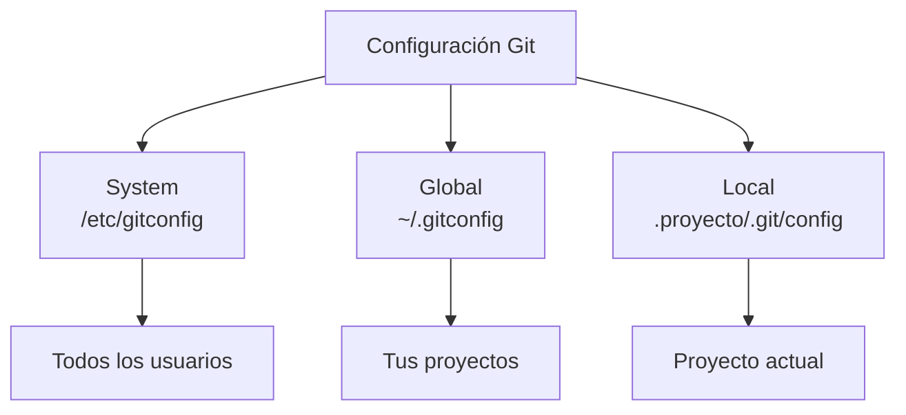

---

## 2.2. Creación y Clonación de Repositorios

### git init vs git clone

Entiende la diferencia entre estas dos operaciones:

| Comando | Cuándo usarlo | Qué hace |
|---------|---------------|----------|
| `git init` | Nuevo proyecto | Crea un repositorio vacío desde cero |
| `git clone` | Proyecto existente | Descarga un repositorio completo |

### git init

Inicializa un nuevo repositorio Git en el directorio actual.

```bash
# Crear y entrar en el directorio
mkdir mi-proyecto
cd mi-proyecto

# Inicializar repositorio Git
git init
# Salida: Initialized empty Git repository in /ruta/a/mi-proyecto/.git/
```

> 📝 **Nota del Profesor:** "El comando `git init` crea una carpeta oculta `.git` que contiene toda la información del repositorio. Esta carpeta es el 'corazón' de Git. ¡No la borres!"

**Estructura del directorio `.git`:**

```
.git/
├── HEAD           # Apunta a la rama actual
├── config         # Configuración del repositorio
├── objects/       # Base de datos de commits, árboles, blobs
│   ├── pack/      # Objetos comprimidos
│   └── info/      # Información adicional
├── refs/          # Referencias a commits (ramas, tags)
│   ├── heads/     # Ramas locales
│   └── tags/      # Etiquetas
└── index          # Área de preparación (staging)
```

### git clone

Descarga una copia idéntica de un repositorio remoto.

```bash
# Clonar desde HTTPS
git clone https://github.com/usuario/repositorio.git

# Clonar y renombrar la carpeta automáticamente
git clone https://github.com/usuario/repositorio.git mi-nombre-proyecto

# Clonar una rama específica
git clone -b nombre-rama https://github.com/usuario/repositorio.git

# Clonar desde SSH (requiere clave SSH configurada)
git clone git@github.com:usuario/repositorio.git
```

> 📝 **Analogía visual:** "Clonar es como fotocopiar un libro entero. Obtienes todas las páginas (archivos) y todo el historial de correcciones (commits) desde que se escribió."

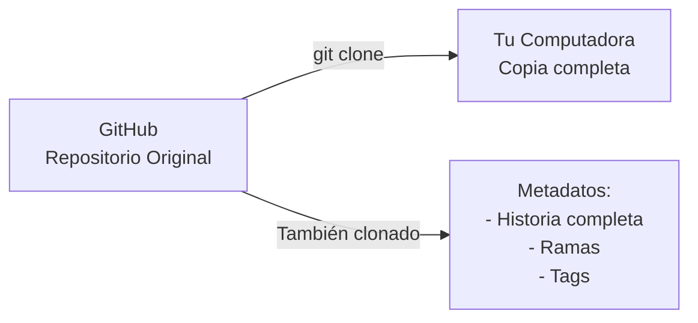

---

## 2.3. Gestión de Cambios: El Ciclo de Trabajo Diario

Este es el flujo más común que usarás a diario:

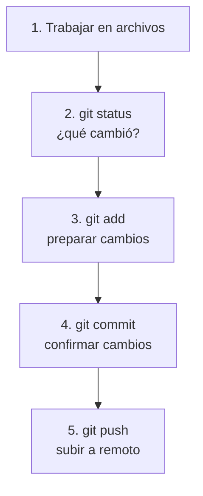

### git status

Muestra el estado actual del directorio de trabajo y del área de preparación.

```bash
git status

# Salida típica cuando todo está limpio:
# On branch main
# Your branch is up to date with 'origin/main'.
# nothing to commit, working tree clean

# Salida con cambios:
# On branch main
# Changes not staged for commit:
#   modified:   archivo.txt
# Untracked files:
#   nuevo_archivo.txt
```

**Interpretando la salida de `git status`:**

| Sección | Significado | Ejemplo |
|---------|-------------|---------|
| **Changes not staged** | Modificado, sin preparar | `modified: archivo.txt` |
| **Changes to be committed** | Preparado, listo para commit | `new file: nuevo.txt` |
| **Untracked files** | Nuevo archivo, sin rastrear | `nuevo_archivo.txt` |

> 📝 **Truco visual:** "Usa `git status -s` para una salida más compacta y fácil de leer."

```bash
# Salida compacta
 M archivo.txt    # Modificado (espacio = unstaged)
M  archivo.txt    # Modificado (staged)
A  nuevo.txt      # Añadido (staged)
?? nuevo.txt      # Sin rastrear (untracked)
```

### git add

Añade los cambios al área de preparación (staging).

```bash
# Añadir un archivo específico
git add archivo.txt

# Añadir todos los archivos modificados
git add .

# Añadir todos los archivos con extensión específica
git add *.java
git add *.py

# Añadir con patrón glob
git add "**/*.css"    # Todos los CSS en cualquier carpeta

# Añadir interactivamente (seleccionar cambios línea a línea)
git add -p

# Ver qué se añadirá sin hacerlo
git add --dry-run .
```

> 💡 **Tip del Examinador:** Pregunta típica: "¿Cuál es la diferencia entre `git add archivo.txt` y `git add .`?"
> **Respuesta:** `git add archivo.txt` añade un archivo específico, mientras que `git add .` añade todos los archivos modificados."

> 📝 **Nota del Profesor:** "El staging es como preparar una caja de mudanza. Decides qué cosas quieres meter antes de cerrarla. Puedes añadir más cosas (`git add`), quitar cosas (`git reset`), o ver qué hay dentro (`git diff --cached`)."

### git commit

Registra los cambios preparados en el historial del proyecto.

```bash
# Commit con mensaje inline
git commit -m "Añadida función de login"

# Commit con mensaje multilínea
git commit -m "Título del commit" -m "Descripción más detallada..."

# Commit de todos los cambios (skip staging)
git commit -a -m "Commit directo"

# Modificar el último commit (si no se ha hecho push)
git commit --amend -m "Mensaje corregido"

# Añadir al último commit sin cambiar mensaje
git commit --amend --no-edit
```

**Anatomía de un buen mensaje de commit:**

```
[Tipo]: [Resumen corto]

[Cuerpo explicativo con más detalles]

[Referencias: #123, fixes #456]
```

**Tipos de commit convencionales:**

| Tipo | Descripción | Ejemplo |
|------|-------------|---------|
| `feat` | Nueva característica | `feat: añadir búsqueda` |
| `fix` | Corrección de bug | `fix: error en login` |
| `docs` | Solo documentación | `docs: actualizar README` |
| `style` | Formato, sin código | `style: formatear código` |
| `refactor` | Reestructuración | `refactor: separar lógica` |
| `test` | Tests | `test: añadir unit tests` |
| `chore` | Mantenimiento | `chore: actualizar dependencias` |

> 📝 **Nota del Profesor:** "Un buen mensaje de commit debería completar la frase: 'Si aplico este commit, entonces...'"

> 💡 **Regla nemotécnica:** "Para un buen commit, usa el imperativo: 'Añadir función' no 'Añadida función'. Es como dar una orden."

### git diff

Muestra las diferencias entre archivos, commits, ramas, etc.

```bash
# Ver cambios NO preparados (working directory vs staging)
git diff

# Ver cambios YA preparados (staging vs último commit)
git diff --staged
git diff --cached    # Alias de --staged

# Ver cambios en un archivo específico
git diff archivo.txt

# Comparar con el commit anterior
git diff HEAD~1

# Comparar con un commit específico
git diff a1b2c3d

# Ver diff resumido (solo estadísticas)
git diff --stat

# Ver diff entre ramas
git diff main develop
```

**Cómo leer el output de `git diff`:**

```diff
diff --git a/archivo.txt b/archivo.txt
index abc1234..def5678 100644
--- a/archivo.txt      # Versión original
+++ b/archivo.txt      # Versión nueva
@@ -1,3 +1,4 @@
- Línea eliminada      # Signo menos = quitada
+ Línea añadida        # Signo más = añadida
+ Nueva línea añadida  # Nueva funcionalidad
```

> 📝 **Nota del Profesor:** "El output de `diff` se parece a un editor de texto. Las lineas con `-` son las que quitaron, las con `+` son las que anadieron."

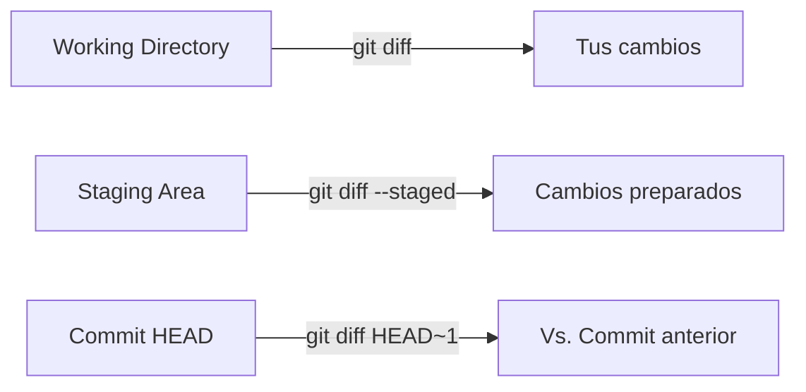

---

## 2.4. Historial y Deshacer Cambios

Dominar el historial y saber deshacer cambios es crucial para trabajar con confianza en Git.

### git log

Explora las revisiones anteriores del proyecto de múltiples formas.

```bash
# Ver historial completo (salida paginada)
git log

# Formato resumido (una línea por commit)
git log --oneline

# Ver últimos N commits
git log -5

# Ver cambios en cada commit
git log -p

# Formato gráfico de ramas
git log --graph --oneline --all

# Ver commits de un autor específico
git log --author="Nombre"

# Ver commits desde una fecha
git log --since="2024-01-01"

# Ver commits que modificaron un archivo específico
git log --follow archivo.txt

# Buscar commits que contengan un texto
git log --grep="login"

# Formato personalizado
git log --pretty=format:"%h - %an, %ar : %s"
```

**Opciones de formato para `git log --pretty=format`:**

| Código | Significado |
|--------|-------------|
| `%h` | Hash corto del commit |
| `%H` | Hash completo |
| `%an` | Nombre del autor |
| `%ae` | Email del autor |
| `%ar` | Fecha relativa |
| `%s` | Asunto del commit |
| `%b` | Cuerpo del commit |

```bash
# Salida de git log --oneline:
# a1b2c3d (HEAD -> main) Añadida función de logout
# e5f6g7h Corregido bug en login
# i9j0k1l Añadida función de login
```

> 📝 **Truco visual:** "Usa `git log --graph --oneline --all` para ver una representacion visual de todas las ramas."

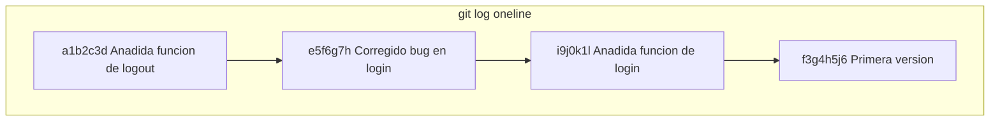

### git show

Muestra los detalles de un commit específico.

```bash
# Ver último commit (HEAD)
git show HEAD

# Ver commit específico (primeros 7 caracteres del hash)
git show a1b2c3d

# Ver cambios de un archivo en un commit
git show a1b2c3d -- archivo.txt

# Ver solo el stats (qué archivos cambiaron)
git show --stat a1b2c3d

# Ver commit anterior
git show HEAD~1
```

### git blame

Muestra quién modificó cada línea de un archivo (útil para encontrar al autor de un bug).

```bash
# Ver autoría línea a línea
git blame archivo.txt

# Ver un rango específico de líneas
git blame -L 10,20 archivo.txt  # Líneas 10 a 20

# Ver blame sin saltos de línea (más fácil de leer)
git blame -w archivo.txt

# Ver blame con formato personalizado
git blame --line-porcelain archivo.txt
```

> 📝 **Nota del Profesor:** "`git blame` es tu detective privado. Te dice exactamente quién escribió cada línea y en qué commit. Úsalo para entender el 'por qué' del código, no para señalar dedos."

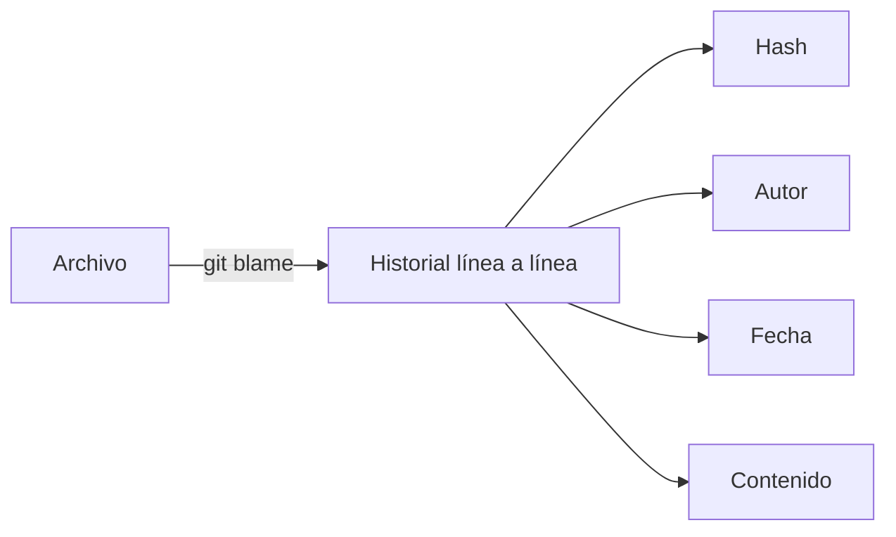

### git revert

Deshace cambios creando un **nuevo commit** (no borra el historial).

```bash
# Revertir el último commit
git revert HEAD

# Revertir un commit específico
git revert a1b2c3d

# Revertir sin confirmar automáticamente
git revert --no-commit a1b2c3d

# Revertir merge commit (más complejo)
git revert -m 1 a1b2c3d
```

> 📝 **Nota del Profesor:** "`git revert` es seguro para repositorios compartidos porque NO reescribe el historial. Crea un nuevo commit que 'deshace' los cambios, dejando evidencia de que se hizo una corrección."

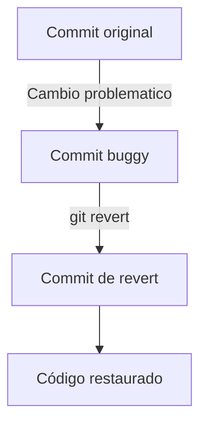

### git reset

Deshace cambios moviendo el puntero HEAD hacia atrás.

> ⚠️ **Advertencia importante:** "`git reset` puede ser peligroso. Nunca lo uses en commits que ya hayas compartido (hecho push)."

```bash
# Reset suave (soft) - solo mueve HEAD
# Los cambios vuelven al staging
git reset --soft HEAD~1

# Reset mixto (mixed, predeterminado)
# Los cambios vuelven al working directory
git reset HEAD~1

# Reset duro (hard) - ¡BORRA TODO!
# Los cambios se pierden completamente
git reset --hard HEAD~1

# Volver a un commit específico (hard)
git reset --hard a1b2c3d

# Reset a main/origin
git reset --hard origin/main
```

**Comparación de los tres tipos de reset:**

| Tipo | HEAD | Staging | Working Directory | Cuándo usarlo |
|------|------|---------|-------------------|---------------|
| `--soft` | ✓ | ✗ | ✗ | "Solo quiero deshacer el commit" |
| `--mixed` | ✓ | ✓ | ✗ | "Quiero rehacer el commit" |
| `--hard` | ✓ | ✓ | ✓ | "Quiero descartar todo" |

> 💡 **Tip del Examinador:** Pregunta típica: "¿Qué diferencia hay entre `git reset --soft` y `git reset --hard`?"
> **Respuesta:** `--soft` solo mueve HEAD, los cambios vuelven al staging. `--hard` borra todo, los cambios se pierden."

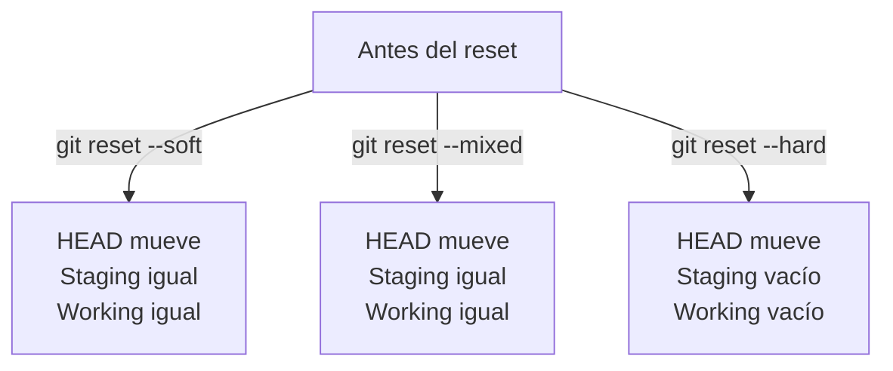

> 📝 **Analogía del reset:** "Imagina que hiciste un commit por error. Con `--soft`, Git te devuelve el contenido a la caja de mudanza (staging). Con `--mixed`, te lo devuelve fuera de la caja. Con `--hard`, Git tira todo a la basura."

### git rm

Elimina archivos del repositorio.

```bash
# Eliminar archivo del working directory Y staging
git rm archivo.txt

# Eliminar solo del staging (mantener archivo en disco)
git rm --cached archivo.txt

# Eliminar múltiples archivos
git rm *.log

# Eliminar directorio completo
git rm -r nombre-directorio/

# Forzar eliminación (si hay cambios sin commit)
git rm -f archivo.txt
```

---

## 2.5. Ramificación y Fusión

Las ramas son una de las características más poderosas de Git. Permiten trabajar en múltiples funcionalidades de forma aislada.

### Concepto de Rama

Una **rama** en Git es simplemente un puntero móvil a un commit. Cuando creas una nueva rama, Git crea un nuevo puntero que puede moverse independientemente.

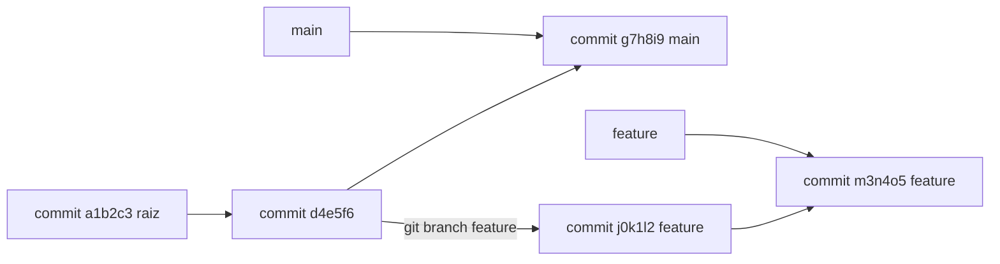

### git branch

Gestiona las ramas del repositorio.

```bash
# Listar ramas locales
git branch

# Listar todas las ramas (incluye remotas)
git branch -a

# Listar ramas con su último commit
git branch -v

# Listar ramas que ya fueron fusionadas
git branch --merged

# Listar ramas que NO han sido fusionadas
git branch --no-merged

# Crear una nueva rama
git branch feature-nueva

# Crear y cambiarte a la nueva rama (atajo)
git checkout -b feature-nueva

# Renombrar rama actual
git branch -m nombre-antiguo nombre-nuevo

# Eliminar rama (si está fusionada)
git branch -d feature-nueva

# Forzar eliminación (sin fusionar)
git branch -D feature-nueva

# Eliminar rama remota
git push origin --delete feature-nueva
```

> 💡 **Tip del Examinador:** Pregunta típica: "¿Qué comando crea una nueva rama y te cambia a ella?"
> **Respuesta:** `git checkout -b nombre-rama` o `git switch -c nombre-rama`"

> 📝 **Nota del Profesor:** "Las ramas en Git son 'baratas' (ligeras). Crear una rama solo crea un puntero, no copia archivos. Por eso podemos tener cientos de ramas."

### git checkout / git switch

Cambia entre ramas o restaura archivos.

```bash
# Cambiar a otra rama
git checkout feature-nueva

# Cambiar a la rama anterior
git checkout -

# Cambiar a un commit específico (modo detach)
git checkout a1b2c3d

# Restaurar archivo al último commit
git checkout -- archivo.txt

# Restaurar archivo desde un commit específico
git checkout a1b2c3d -- archivo.txt

# Desde Git 2.23, usa switch (más claro)
git switch feature-nueva
git switch -          # Volver a la rama anterior
git switch -c feature # Crear y cambiar
```

> 📝 **Nota del Profesor:** "Desde Git 2.23, `git switch` es el comando recomendado para cambiar de rama. `git checkout` todavía funciona, pero 'switch' es más seguro y su nombre es más descriptivo."

### git merge

Integra los cambios de una rama en otra.

```bash
# Fusionar feature en main
git checkout main
git merge feature

# Fusionar con mensaje personalizado
git merge feature -m "Merge: nueva funcionalidad"

# Fusionar sin fast-forward (siempre crea merge commit)
git merge --no-ff feature

# Fusionar con estrategia de 'theirs' (si hay conflictos)
git merge -X theirs feature

# Fusionar abortando si hay conflictos
git merge --abort
```

**Tipos de Merge:**

| Tipo | Descripción | Cuándo usarlo |
|------|-------------|---------------|
| **Fast-forward** | Mueve el puntero hacia adelante | No hay cambios en main |
| **Merge commit** | Crea un nuevo commit | Hay cambios divergentes |
| **Conflict** | Requiere resolución manual | Mismos archivos modificados |

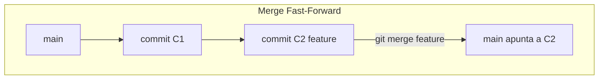

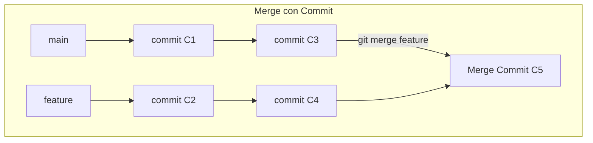

> 📝 **Nota del Profesor:** "La fusion a tres bandas es como拼图(puzzle): Git usa el ancestro comun la imagen original y las dos versiones actuales para determinar que cambio en cada una."

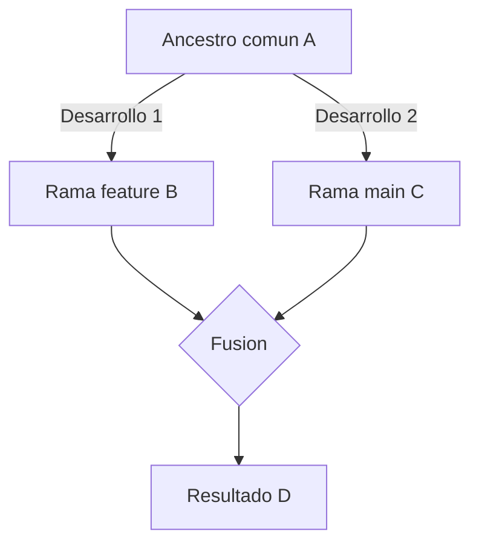

### Resolucion de Conflictos

Cuando Git no puede fusionar automáticamente, debes resolver los conflictos manualmente.

**Pasos para resolver conflictos:**

1. Identifica los archivos en conflicto
2. Abre los archivos y busca los marcadores de conflicto
3. Edita el archivo para resolver el conflicto
4. Elimina los marcadores de conflicto
5. Añade el archivo resuelto
6. Confirma la fusión

```bash
# Ver estado de conflictos
git status

# Ver conflictos
git diff

# Marcadores de conflicto en el archivo:
# <<<<<<< HEAD
# código de main
# =======
# código de feature
# >>>>>>> feature

# Después de resolver, añade el archivo
git add archivo-resuelto

# Finalizar el merge
git commit
```

### git rebase

Reorganiza la historia del proyecto moviendo commits a una nueva base.

```bash
# Rebase de feature sobre main
git checkout feature
git rebase main

# Continuar después de resolver conflictos
git rebase --continue

# Abortar el rebase
git rebase --abort

# Rebase interactivo (editar, eliminar, combinar commits)
git rebase -i HEAD~5

# Rebase sin confirmar automáticamente
git rebase --no-verify
```

**Operaciones en rebase interactivo:**

| Comando | Descripción |
|---------|-------------|
| `pick` | Mantener el commit |
| `reword` | Cambiar el mensaje |
| `edit` | Detener para modificar |
| `squash` | Fusionar con commit anterior |
| `fixup` | Fusionar, descartar mensaje |
| `drop` | Eliminar commit |

> ⚠️ **Regla de Oro del Rebase:** "Nunca uses `git rebase` en ramas públicas que ya han sido compartidas. Rebase reescribe el historial y puede causar problemas a otros desarrolladores."

> 📝 **Diferencia Merge vs Rebase:**
> - **Merge**: Conserva el historial tal cual, crea commit de fusión
> - **Rebase**: Historial lineal, reescribe commits

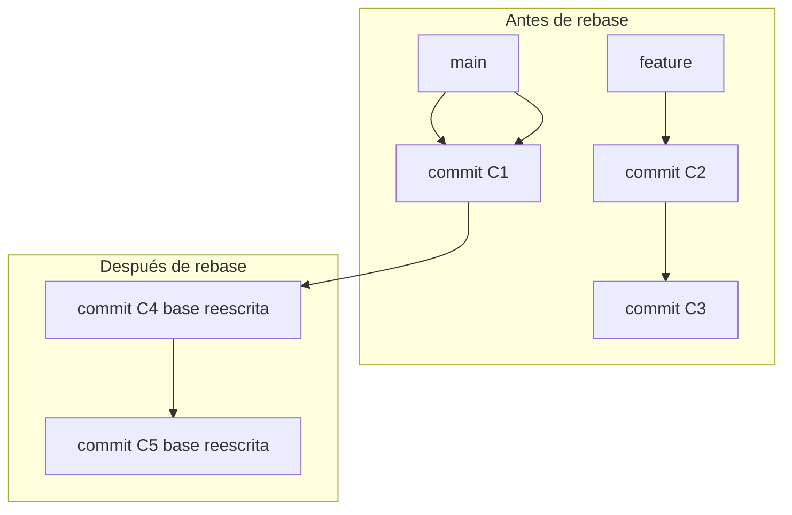

> 💡 **Regla nemotécnica:** "Merge es como pegar una foto en un álbum (queda el momento exacto). Rebase es como reorganizar las páginas del álbum para que la historia fluya mejor."

---

## 2.6. Ignorar Archivos

### .gitignore

Archivo donde listes los patrones que Git debe ignorar.

```bash
# Ejemplo de .gitignore

# Ignorar todos los archivos .log
*.log

# Ignorar el directorio node_modules
node_modules/

# Ignorar archivos temporales
*~
*.swp
*.tmp

# Ignorar directorio de compilación
build/
dist/

# No ignorar archivo específico
!importante.txt

# Ignorar solo en la raíz
/*.log

# Ignorar en cualquier subdirectorio
**/*.log

# Ignorar archivos de un directorio específico
carpeta/*.tmp
```

**Plantillas de .gitignore por lenguaje:**

| Lenguaje/Framework | Incluir |
|-------------------|---------|
| **Node.js** | node_modules/, package-lock.json |
| **Python** | __pycache__/, *.pyc, venv/ |
| **Java** | target/, *.jar, .class |
| **.NET** | bin/, obj/, *.dll |
| **macOS** | .DS_Store |
| **Windows** | Thumbs.db |

> 📝 **Nota del Profesor:** "El archivo `.gitignore` debe crearse al inicio del proyecto para evitar añadir archivos no deseados. También puedes tener un `.gitignore` global en tu directorio personal."

---

## 2.7. Etiquetado (Tags)

### git tag

Etiqueta puntos específicos del historial para marcar versiones.

```bash
# Listar etiquetas
git tag

# Listar etiquetas con patrón
git tag -l "v1.*"

# Crear etiqueta ligera
git tag v1.0.0

# Crear etiqueta anotada (recomendado)
git tag -a v1.0.0 -m "Versión 1.0.0 estable"

# Ver información de etiqueta
git show v1.0.0

# Etiquetar un commit específico
git tag -a v0.9 a1b2c3d

# Eliminar etiqueta local
git tag -d v1.0.0

# Eliminar etiqueta remota
git push origin --delete v1.0.0

# Subir etiquetas al remoto
git push origin --tags
```

| Tipo | Descripción | Uso |
|------|-------------|-----|
| **Ligera** | Simple puntero a commit | `git tag v1.0` |
| **Anotada** | Objeto completo con metadata | `git tag -a v1.0 -m "mensaje"` |

> 💡 **Tip del Examinador:** Pregunta típica: "¿Qué diferencia hay entre una etiqueta ligera y una anotada en Git?"
> **Respuesta:** Las etiquetas ligeras son simples punteros a commits. Las anotadas son objetos completos con autor, fecha y mensaje, y están firmadas criptográficamente."

---

## 2.8. Trabajar con Remotos

### git remote

Gestiona los repositorios remotos.

```bash
# Añadir remoto
git remote add origin https://github.com/usuario/proyecto.git

# Ver remotos configurados
git remote -v

# Ver información del remoto
git remote show origin

# Cambiar URL del remoto
git remote set-url origin nuevo-url.git

# Renombrar remoto
git remote rename origin upstream

# Eliminar remoto
git remote remove origin

# Recargar información del remoto
git remote update
```

### git push

Sube los commits al repositorio remoto.

```bash
# Subir rama main
git push origin main

# Primera vez (establecer tracking)
git push -u origin main

# Subir etiqueta específica
git push origin v1.0.0

# Forzar push (¡peligroso!)
git push --force

# Forzar con lease (más seguro)
git push --force-with-lease

# Subir todas las etiquetas
git push origin --tags

# Eliminar rama remota
git push origin --delete nombre-rama
```

> ⚠️ **Advertencia:** "Nunca uses `git push --force` en ramas compartidas. Usa `--force-with-lease` que verifica que nadie más haya pushado."

### git fetch

Descarga cambios sin fusionarlos.

```bash
# Fetch de todos los remotos
git fetch

# Fetch de un remoto específico
git fetch origin

# Fetch de todas las ramas
git fetch --all

# Fetch y podar ramas eliminadas
git fetch --prune
```

### git pull

Descarga y fusiona cambios.

```bash
# Pull con fetch + merge
git pull origin main

# Pull con rebase
git pull --rebase origin main

# Pull solo si no hay cambios locales
git pull --ff-only origin main

# Pull sin autocommit
git pull --no-commit
```

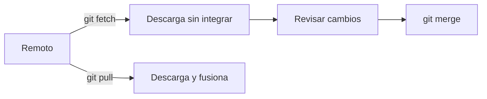

> 💡 **Tip del Examinador:** Pregunta típica: "¿Cuál es la diferencia entre `git fetch` y `git pull`?"
> **Respuesta:** `git fetch` solo descarga los cambios, `git pull` los descarga Y fusiona automáticamente."

---

## 2.9. Resumen de Comandos Diarios

```bash
# Flujo de trabajo típico

# 1. Empezar el día: sincronizar
git checkout main
git pull origin main

# 2. Crear rama para tu tarea
git checkout -b feature/mi-tarea

# 3. Trabajar y hacer commits
git add .
git commit -m "Añadido componente X"

# 4. Subir regularmente
git push origin feature/mi-tarea

# 5. Actualizar mientras trabajas
git fetch origin
git rebase origin/main

# 6. Cuando esté listo: crear PR en GitHub
```

> 💡 **Regla nemotécnica:** "Merge es como pegar una foto en un álbum (queda el momento exacto). Rebase es como reorganizar las páginas del álbum para que la historia fluya mejor."
```

### git revert

Deshace cambios creando un nuevo commit (no borra el historial).

```bash
# Revertir el último commit
git revert HEAD

# Revertir un commit específico
git revert a1b2c3d

# Revertir sin confirmar automáticamente
git revert --no-commit a1b2c3d
```

> 📝 **Nota del Profesor:** "`git revert` es seguro para repositorios compartidos porque no reescribe el historial. Crea un nuevo commit que 'deshace' los cambios."

### git reset

Deshace cambios moviendo el puntero HEAD.

```bash
# Reset suave (mantiene cambios en staging)
git reset --soft HEAD~1

# Reset mixto (predeterminado, mantiene cambios en working directory)
git reset HEAD~1

# Reset duro (¡BORRA TODO!)
git reset --hard HEAD~1

# Volver a un commit específico (borra todo lo posterior)
git reset --hard a1b2c3d
```

> ⚠️ **Advertencia:** "`git reset --hard` elimina permanentemente los cambios. ¡Úsalo con extrema precaución!"

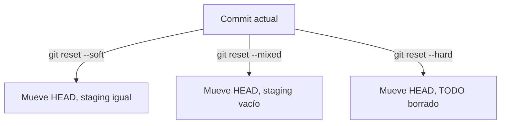

### git rm

Elimina archivos del repositorio.

```bash
# Eliminar archivo del working directory y staging
git rm archivo.txt

# Eliminar solo del staging (mantener en disco)
git rm --cached archivo.txt

# Eliminar múltiples archivos
git rm *.log
```

---

## 2.5. Ramificación y Fusión

### git branch

Gestiona las ramas del repositorio.

```bash
# Listar ramas locales
git branch

# Listar todas las ramas (incluye remotas)
git branch -a

# Crear una nueva rama
git branch feature-nueva

# Crear y cambiarte a la nueva rama
git checkout -b feature-nueva

# Renombrar rama actual
git branch -m nombre-antiguo nombre-nuevo

# Eliminar rama (si está fusionada)
git branch -d feature-nueva

# Forzar eliminación
git branch -D feature-nueva
```

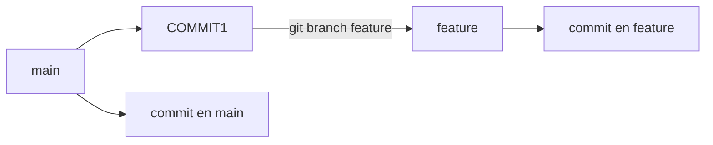

### git checkout

Cambia entre ramas o restaura archivos.

```bash
# Cambiar a otra rama
git checkout feature-nueva

# Cambiar a rama anterior
git checkout -

# Restaurar archivo al último commit
git checkout -- archivo.txt

# Restaurar desde un commit específico
git checkout a1b2c3d -- archivo.txt
```

> 📝 **Nota del Profesor:** "Desde Git 2.23, puedes usar `git switch` para cambiar de rama (más seguro que checkout)."

### git merge

Integra los cambios de una rama en otra.

```bash
# Fusionar feature en main
git checkout main
git merge feature

# Fusionar sin fast-forward (crea merge commit)
git merge --no-ff feature

# Fusionar con estrategia de recursive
git merge -X theirs feature  # Si hay conflictos, usar cambios de feature
```


> 📝 **Nota del Profesor:** "La fusion a tres bandas es como拼图(puzzle): Git usa el ancestro comun la imagen original y las dos versiones actuales para determinar que cambio en cada una."

### git rebase

Reorganiza la historia del proyecto.

```bash
# Rebase de feature sobre main
git checkout feature
git rebase main

# Continuar después de resolver conflictos
git rebase --continue

# Abortar el rebase
git rebase --abort

# Rebase interactivo (editar, eliminar, combinar commits)
git rebase -i HEAD~5
```

> ⚠️ **Regla de Oro del Rebase:** "Nunca uses `git rebase` en ramas públicas que ya han sido compartidas."

---

## 2.6. Ignorar Archivos

### .gitignore

Archivo donde listes los patrones que Git debe ignorar.

```bash
# Ejemplo de .gitignore

# Ignorar todos los archivos .log
*.log

# Ignorar el directorio node_modules
node_modules/

# Ignorar archivos temporales
*~
*.swp
*.tmp

# Ignorar directorio de compilación
build/
dist/

# No ignorar archivo específico
!importante.txt

# Ignorar solo en la raíz
/*.log

# Ignorar en cualquier subdirectorio
**/*.log
```

> 📝 **Nota del Profesor:** "El archivo `.gitignore` debe crearse al inicio del proyecto para evitar añadir archivos no deseados."

---

## 2.7. Etiquetado (Tags)

### git tag

Etiqueta puntos específicos del historial.

```bash
# Listar etiquetas
git tag

# Crear etiqueta ligera
git tag v1.0.0

# Crear etiqueta anotada (recomendado)
git tag -a v1.0.0 -m "Versión 1.0.0 estable"

# Ver información de etiqueta
git show v1.0.0

# Etiquetar un commit específico
git tag -a v0.9 a1b2c3d

# Eliminar etiqueta local
git tag -d v1.0.0

# Subir etiquetas al remoto
git push origin --tags
```

| Tipo | Descripción | Uso |
|------|-------------|-----|
| **Ligera** | Simple puntero a commit | `git tag v1.0` |
| **Anotada** | Objeto completo con metadata | `git tag -a v1.0 -m "mensaje"` |

---

## 2.8. Trabajar con Remotos

### git remote

Gestiona los repositorios remotos.

```bash
# Añadir remoto
git remote add origin https://github.com/usuario/proyecto.git

# Ver remotos configurados
git remote -v

# Ver información del remoto
git remote show origin

# Cambiar URL del remoto
git remote set-url origin nuevo-url.git

# Eliminar remoto
git remote remove origin
```

### git push

Sube los commits al repositorio remoto.

```bash
# Subir rama main
git push origin main

# Primera vez (establecer tracking)
git push -u origin main

# Forzar push (¡peligroso!)
git push --force

# Subir etiquetas
git push origin v1.0.0
```

### git fetch

Descarga cambios sin fusionarlos.

```bash
# Fetch de todos los remotos
git fetch

# Fetch de un remoto específico
git fetch origin
```

### git pull

Descarga y fusiona cambios.

```bash
# Pull con fetch + merge
git pull origin main

# Pull con rebase
git pull --rebase origin main

# Pull solo si no hay cambios locales
git pull --ff-only origin main
```


> 💡 **Tip del Examinador:** Pregunta típica: "¿Cuál es la diferencia entre `git fetch` y `git pull`?"
> **Respuesta:** `git fetch` solo descarga los cambios, `git pull` los descarga Y fusiona automáticamente.
