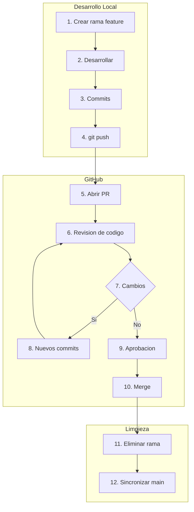
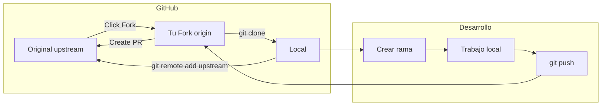
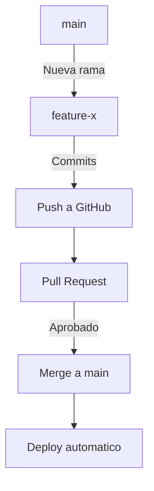
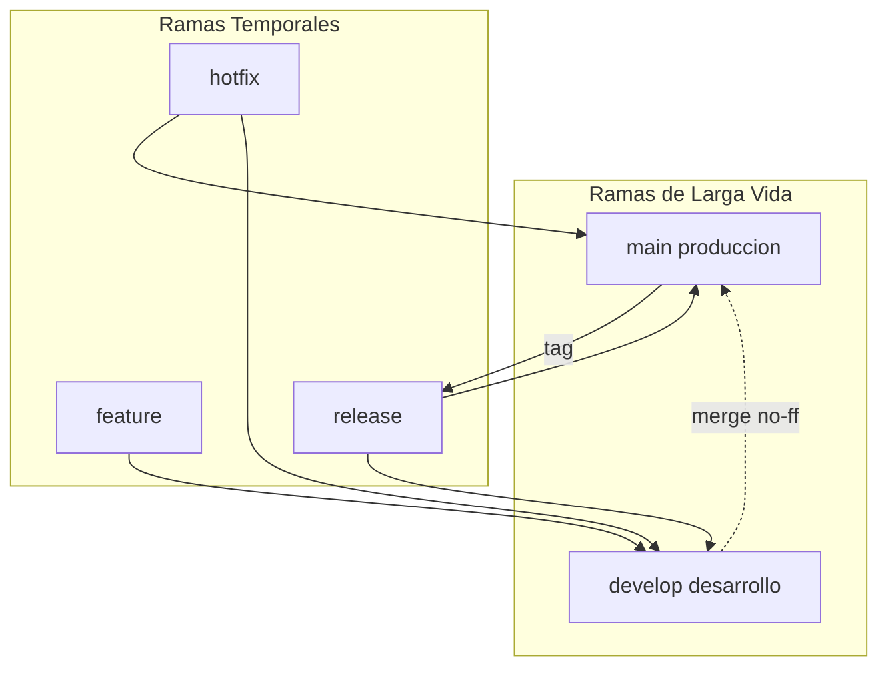

- [3. GitHub y Flujos de Trabajo Colaborativos](#3-github-y-flujos-de-trabajo-colaborativos)
  - [3.1. GitHub para la Colaboración](#31-github-para-la-colaboración)
    - [¿Qué ofrece GitHub?](#qué-ofrece-github)
  - [3.2. Pull Requests (Solicitudes de Incorporación de Cambios)](#32-pull-requests-solicitudes-de-incorporación-de-cambios)
    - [¿Qué es una Pull Request?](#qué-es-una-pull-request)
    - [Anatomía de una Buena Pull Request](#anatomía-de-una-buena-pull-request)
    - [Flujo Completo de una Pull Request](#flujo-completo-de-una-pull-request)
    - [Buenas Prácticas para Pull Requests](#buenas-prácticas-para-pull-requests)
  - [3.3. Fork (Bifurcación)](#33-fork-bifurcación)
    - [Fork vs Clone](#fork-vs-clone)
    - [¿Cuándo usar Fork?](#cuándo-usar-fork)
    - [Flujo de Trabajo Completo con Fork](#flujo-de-trabajo-completo-con-fork)
    - [Pasos Detallados para Contribuir](#pasos-detallados-para-contribuir)
    - [Sincronizar Fork con Original](#sincronizar-fork-con-original)
  - [3.4. Flujos de Trabajo Comunes en Git](#34-flujos-de-trabajo-comunes-en-git)
    - [3.4.1. GitHub Flow](#341-github-flow)
    - [3.4.2. GitFlow](#342-gitflow)
    - [Comparacion de Flujos](#comparacion-de-flujos)
  - [3.5. Buenas Practicas de Colaboracion](#35-buenas-practicas-de-colaboracion)
    - [Commits Significativos](#commits-significativos)
    - [Nombres de Ramas](#nombres-de-ramas)
    - [Workflow Diario Recomendado](#workflow-diario-recomendado)


# 3. GitHub y Flujos de Trabajo Colaborativos

En este módulo aprenderás a utilizar GitHub como plataforma de colaboración y los flujos de trabajo más comunes en equipos de desarrollo. GitHub no es solo un servidor Git, es un ecosistema completo de colaboración.

---

## 3.1. GitHub para la Colaboración

**GitHub** es una plataforma de alojamiento de repositorios Git que va más allá de ser un simple servidor. Es un centro de colaboración, gestión de proyectos y una red social para desarrolladores.

### ¿Qué ofrece GitHub?

| Herramienta | Descripción | Uso Principal |
|-------------|-------------|---------------|
| **Repositories** | Alojamiento de código | Almacenar proyectos |
| **Pull Requests** | Revisión de código | Colaboración |
| **Issues** | Seguimiento de tareas | Gestión de proyectos |
| **Actions** | CI/CD | Automatización |

> 📝 **Nota del Profesor:** "GitHub es como 'Facebook para desarrolladores'. No solo aloja tu código, sino que facilita la colaboración entre equipos y la contribución a proyectos de código abierto. Cada perfil es tu currículum técnico."

---

## 3.2. Pull Requests (Solicitudes de Incorporación de Cambios)

Una **Pull Request (PR)** es una herramienta de comunicación fundamental en el desarrollo colaborativo. Es el corazón de la colaboración en GitHub.

### ¿Qué es una Pull Request?

Es una solicitud para incorporar cambios de una rama a otra. Permite:

- **Proponer cambios**: Mostrar qué cambios quieres aportar
- **Solicitar revisión**: Que otros developers revisen tu código
- **Discutir modificaciones**: Conversación sobre el código
- **Mantener historial limpio**: Solo se fusiona código aprobado

> 💡 **Tip del Examinador:** Pregunta típica: "¿Qué es un Pull Request y para qué sirve?"
> **Respuesta:** Es una solicitud para fusionar cambios de una rama a otra. Sirve para revisar código antes de integrarlo, discutir cambios, y mantener la calidad del código."

### Anatomía de una Buena Pull Request

```markdown
## Título
feat: Añadir sistema de notificaciones

## Descripción
Este PR implementa el sistema de notificaciones descrito en #123.

### Cambios realizados
- Creado componente NotificationCard
- Añadido servicio NotificationService
- Integración con WebSocket para tiempo real

### Capturas de pantalla
![notificaciones]

### Testing
- Tests unitarios para NotificationService ✓
- Tests de integración con WebSocket ✓

### Checklist
- [x] Código formateado
- [x] Tests pasando
- [x] Documentación actualizada
- [x] Sin warnings de linting
```

### Flujo Completo de una Pull Request



### Buenas Prácticas para Pull Requests

> 📝 **Regla nemotécnica:** "PR PEQUEÑO = Revision RAPIDA. Divide tu trabajo en PRs manejables."

| Práctica | Descripción | Por qué |
|----------|-------------|---------|
| **PRs pequeños** | Menos de 400 líneas | Más fácil de revisar |
| **Titulo claro** | Describe el cambio | Busqueda y referencia |
| **Descripcion completa** | Explica contexto | Entienden mejor el cambio |
| **Self-review** | Revísate tú primero | Detecta errores obvios |
| **Responde rapido** | A comments y reviews | Mantiene el flujo |
| **Un PR = Una cosa** | Cambios relacionados | Facilita el review |

> 💡 **Tip del Examinador:** Pregunta tipica: "¿Por que es importante hacer Pull Requests pequenas?"
> **Respuesta:** Son mas faciles de revisar, reducen errores, permiten identificar problemas mas rapido y facilitan la integracion continua."

---

## 3.3. Fork (Bifurcación)

Un **Fork** es crear una copia de un repositorio existente en tu propia cuenta de GitHub. Es fundamental para contribuir a proyectos de código abierto.

### Fork vs Clone

| Operacion | Que hace | Donde esta |
|-----------|----------|------------|
| **Clone** | Copia repositorio a tu maquina | Tu ordenador |
| **Fork** | Copia repositorio a tu cuenta GitHub | GitHub tu cuenta |

### ¿Cuándo usar Fork?

- Proyectos de código abierto donde no tienes permisos
- Contribuir a proyectos ajenos
- Experimentar sin afectar el original

> 📝 **Analogia del Fork:** "Fork es como fotocopiar un libro entero y llevártelo a casa. Puedes modificarlo como quieras (es tu copia), y si quieres que tus cambios aparezcan en el original, envías las páginas modificadas al autor original."

### Flujo de Trabajo Completo con Fork



### Pasos Detallados para Contribuir

```bash
# 1. HACER FORK EN GITHUB
# Click en boton "Fork" en la pagina del repositorio original

# 2. CLONAR TU FORK
git clone https://github.com/TU-USUARIO/proyecto.git
cd proyecto

# 3. AÑADIR REMOTO ORIGINAL (llamado upstream)
git remote add upstream https://github.com/ORIGINAL/proyecto.git

# 4. VER REMOTOS CONFIGURADOS
git remote -v
# origin  https://github.com/TU-USUARIO/proyecto.git (fetch)
# origin  https://github.com/TU-USUARIO/proyecto.git (push)
# upstream https://github.com/ORIGINAL/proyecto.git (fetch)
# upstream https://github.com/ORIGINAL/proyecto.git (push)

# 5. CREAR RAMA PARA TUS CAMBIOS
git checkout -b mi-contribucion

# 6. TRABAJAR Y HACER COMMITS
git add .
git commit -m "feat: añadir mi contribucion"

# 7. SUBIR A TU FORK
git push origin mi-contribucion

# 8. CREAR PULL REQUEST DESDE GITHUB
# Ir a tu fork en GitHub -> Click en "Compare and pull request"
```

### Sincronizar Fork con Original

```bash
# Metodo 1: Fetch + Merge
git fetch upstream
git checkout main
git merge upstream/main

# Metodo 2: Pull directo
git pull upstream main

# Metodo 3: Rebase (historial mas limpio)
git fetch upstream
git checkout main
git rebase upstream/main

# Subir cambios a tu fork
git push origin main
```

> ⚠️ **Importante:** "Nunca hagas cambios directamente en la rama main de tu fork. Siempre crea una nueva rama para cada contribucion."

---

## 3.4. Flujos de Trabajo Comunes en Git

Para coordinar el trabajo de un equipo, es necesario acordar cómo se utilizará Git. Los flujos de trabajo definen las reglas del juego.

### 3.4.1. GitHub Flow

Flujo de trabajo simple y agil, centrado en ramas de vida corta y despliegues continuos.

**Principios del GitHub Flow:**



1. **La rama `main` siempre esta lista para desplegar** - En cualquier momento puedes hacer deploy
2. **Trabaja en ramas** - Cada funcionalidad = nueva rama
3. **Commits regulares** - Historial detallado
4. **Abre PR para cada cambio** - incluso pequeno
5. **Merge despues de approval** - Codigo revisado
6. **Deploy inmediatamente** - Entrega continua

> 💡 **Tip del Examinador:** Pregunta tipica: "¿Cuándo usar GitHub Flow?"
> **Respuesta:** En proyectos web con despliegue continuo, equipos pequenos, y cuando quieres mover rapido."

**Ejemplo de GitHub Flow:**

```bash
# 1. Empezar desde main actualizado
git checkout main
git pull origin main

# 2. Crear rama para nueva funcionalidad
git checkout -b feature/nuevo-login

# 3. Trabajar y hacer commits
git add .
git commit -m "feat: añadir formulario de login"

# 4. Subir y crear PR
git push origin feature/nuevo-login
# -> Crear PR en GitHub -> Review -> Merge

# 5. Despues del merge
git checkout main
git pull origin main  # Tu main ya tiene los cambios
```

### 3.4.2. GitFlow

Metodologia mas estructurada para proyectos con ciclos de release definidos.



**Estructura de Ramas en GitFlow:**

| Rama | Proposito | Vida | Cuando crearla |
|------|-----------|------|----------------|
| `main` | Produccion, versiones estables | Permanente | Inicial |
| `develop` | Integracion de features | Permanente | Inicial |
| `feature/` | Nuevas funcionalidades | Temporal | De develop |
| `release/` | Preparacion de release | Temporal | De develop |
| `hotfix/` | Correcciones urgentes | Temporal | De main |

**Comandos con GitFlow:**

```bash
# Inicializar GitFlow
git flow init

# Feature
git flow feature start mi-feature      # Crear
git flow feature finish mi-feature     # Merge a develop

# Release
git flow release start 1.0.0          # Crear de develop
git flow release finish 1.0.0         # Merge a main + develop + tag

# Hotfix
git flow hotfix start bug-urgente     # Crear de main
git flow hotfix finish bug-urgente    # Merge a main + develop
```

> 📝 **Nota del Profesor:** "GitFlow es ideal para proyectos con versiones numeradas (v1.0, v2.0) como software comercial o librerias. GitHub Flow es mejor para aplicaciones web con despliegues frecuentes."

### Comparacion de Flujos

| Caracteristica | GitHub Flow | GitFlow |
|----------------|-------------|---------|
| **Complejidad** | Simple | Media-Alta |
| **Ramas principales** | Solo `main` | `main` + `develop` |
| **Release management** | Continuo | Con versiones |
| **Hotfixes** | Rama desde main | Rama dedicada |
| **Mejor para** | Web apps, DevOps | Software comercial |
| **Release branches** | No | Si |

> 💡 **Regla nemotecnica:** "Web continuo = GitHub Flow. Versiones definidas = GitFlow."

---

## 3.5. Buenas Practicas de Colaboracion

### Commits Significativos

```bash
# ❌ Malos mensajes
git commit -m "fix"
git commit -m "updates"
git commit -m "wip"

# ✅ Buenos mensajes
git commit -m "Corregido error de login cuando email esta vacio"
git commit -m "Añadida validacion de contrasena minima (minimo 8 caracteres)"
git commit -m "Actualizada dependencia axios a v1.0.0 para seguridad"
```

> 📝 **Regla del imperativo:** "Escribe tus mensajes como si dieras una orden: 'Añadir funcion' no 'Añadida funcion'."

### Nombres de Ramas

| Prefijo | Uso | Ejemplo |
|---------|-----|---------|
| `feature/` | Nueva funcionalidad | `feature/login-redes-sociales` |
| `bugfix/` | Correccion de error | `bugfix/error-500-login` |
| `hotfix/` | Correccion urgente | `hotfix/security-patch` |
| `release/` | Preparacion release | `release/v2.1.0` |
| `docs/` | Solo documentacion | `docs/update-readme` |
| `refactor/` | Reestructuracion | `refactor/auth-service` |

### Workflow Diario Recomendado

```bash
# 1. Empezar el dia: sincronizar
git checkout main
git pull origin main

# 2. Crear rama para tu tarea
git checkout -b feature/mi-tarea

# 3. Trabajar y hacer commits pequenos
git add .
git commit -m "feat: paso 1 del componente"

# 4. Subir regularmente
git push origin feature/mi-tarea

# 5. Mantener actualizado mientras trabajas
git fetch origin
git rebase origin/main

# 6. Cuando este listo: crear PR en GitHub
```

> 💡 **Tip del Examinador:** Pregunta tipica: "¿Cual es la diferencia entre Fork y Clone?"
> **Respuesta:** Clone copia un repositorio a tu maquina local. Fork copia un repositorio completo a tu cuenta de GitHub para poder contribuir a proyectos donde no tienes permisos."
