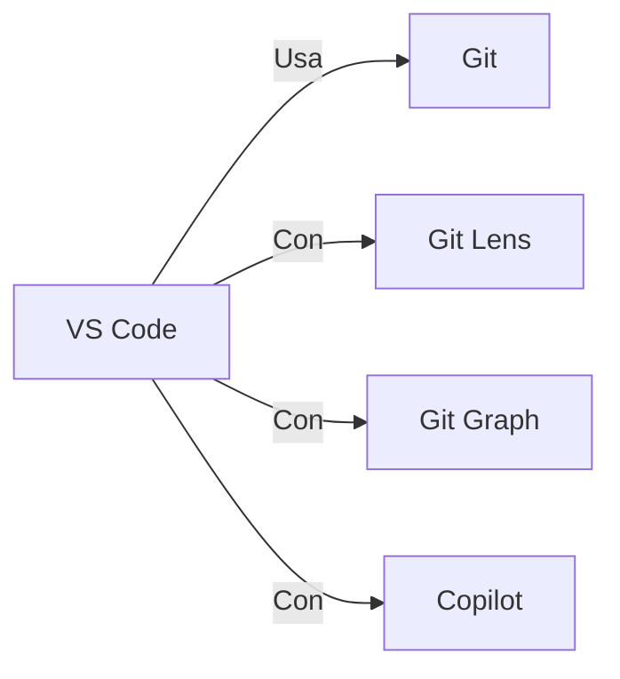
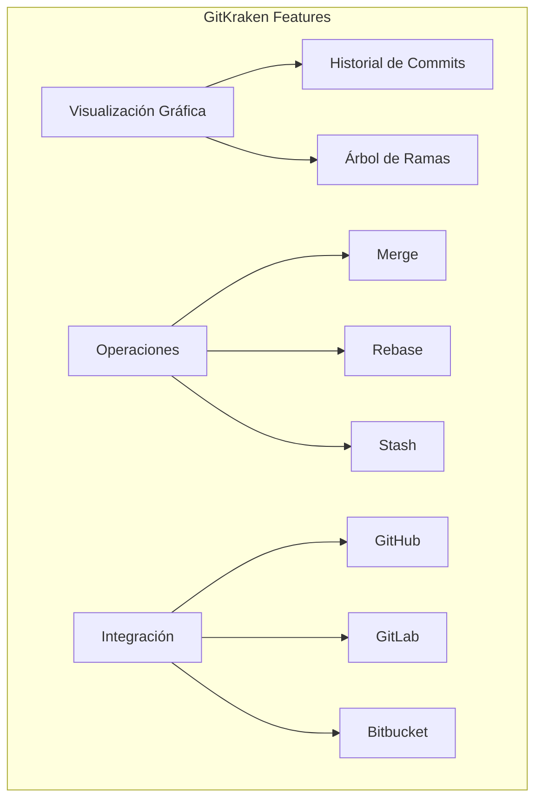
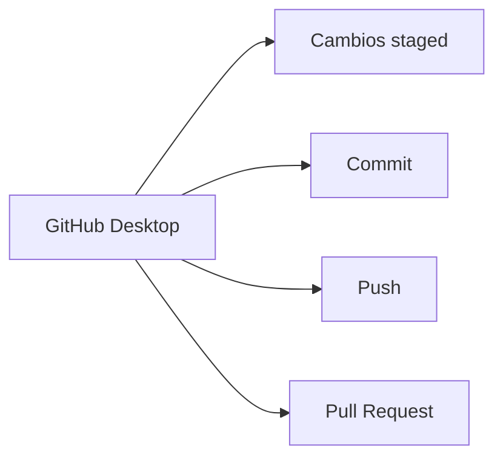

- [4. Herramientas Complementarias para Git y GitHub](#4-herramientas-complementarias-para-git-y-github)
  - [4.1. Editores de Código con Integración Git](#41-editores-de-código-con-integración-git)
    - [Visual Studio Code (VS Code)](#visual-studio-code-vs-code)
  - [4.2. Clientes Git Gráficos](#42-clientes-git-gráficos)
    - [GitKraken](#gitkraken)
    - [GitHub Desktop](#github-desktop)
  - [4.3. Herramientas de Línea de Comandos Avanzadas](#43-herramientas-de-línea-de-comandos-avanzadas)
    - [Git Alias](#git-alias)
    - [Oh My Zsh con plugin git](#oh-my-zsh-con-plugin-git)
  - [4.4. Herramientas de Comparación](#44-herramientas-de-comparación)
    - [gitk](#gitk)
    - [GitHub/GitLab Diff](#githubgitlab-diff)
  - [4.5. Herramientas de Recuperación](#45-herramientas-de-recuperación)
    - [git reflog](#git-reflog)
    - [git fsck](#git-fsck)
  - [4.6. Comparativa de Herramientas](#46-comparativa-de-herramientas)
  - [4.7. Configuración de Entorno de Desarrollo](#47-configuración-de-entorno-de-desarrollo)
    - [.gitconfig personal](#gitconfig-personal)
    - [.gitignore global](#gitignore-global)


# 4. Herramientas Complementarias para Git y GitHub

En este módulo conocerás las herramientas GUI y extensiones que facilitan el trabajo con Git y GitHub.

---

## 4.1. Editores de Código con Integración Git

### Visual Studio Code (VS Code)

Editor de código muy popular con fuerte integración Git.

**Extensiones esenciales:**

| Extensión | Descripción |
|-----------|-------------|
| **Git Lens** | Muestra autoría de líneas, historial de commits |
| **Git Graph** | Visualiza el historial de commits y ramas |
| **Gitflow Actions** | Interfaz gráfica para GitFlow |
| **GitHub Copilot** | IA para autocompletar código |

> 📝 **Nota del Profesor:** "VS Code con Git Lens es como tener 'git blame' visible permanentemente. Puedes ver quién escribió cada línea con solo pasar el mouse."



**Atajos útiles en VS Code:**

| Atajo | Acción |
|-------|--------|
| `Ctrl+Shift+G` | Abrir panel Git |
| `Ctrl+Enter` | Ver cambios del commit seleccionado |
| `M` | Stage/unstage archivo |

---

## 4.2. Clientes Git Gráficos

### GitKraken

Considerado por muchos como la mejor herramienta GUI para Git.

**Características:**

- Interfaz visual e interactiva
- Gestión de repositorios, ramas, merges
- Soporte integrado para GitFlow
- Consola de *logs* con comandos ejecutados
- Integración con GitHub, GitLab, Bitbucket

> 📝 **Nota del Profesor:** "GitKraken es excelente para aprender Git porque muestra los comandos que ejecuta por cada acción. ¡Es como ver la receta mientras cocina!"



### GitHub Desktop

Cliente gráfico oficial de GitHub para Windows y Mac.

**Enfoque:**

- Simplifica operaciones comunes
- Interfaz intuitiva para principiantes
- Centrado en flujo de trabajo GitHub
- Crear ramas, commits y Pull Requests fácil



---

## 4.3. Herramientas de Línea de Comandos Avanzadas

### Git Alias

Crea accesos directos para comandos frecuentes.

```bash
# Ver todos los alias
git config --get-regexp alias

# Crear alias
git config --global alias.st status
git config --global alias.co checkout
git config --global alias.br branch
git config --global alias.ci commit
git config --global alias.df diff

# Alias útiles
git config --global alias.unstage 'reset HEAD --'
git config --global alias.last 'log -1 HEAD'
git config --global alias.visual '!gitk'

# Ver log resumido
git config --global alias.lg "log --color --graph --pretty=format:'%Cred%h%Creset -%C(yellow)%d%Creset %s %Cgreen(%cr) %C(bold blue)<%an>%Creset' --abbrev-commit"
```

### Oh My Zsh con plugin git

Si usas Zsh, el plugin git proporciona muchos atajos:

```bash
# En ~/.zshrc
plugins=(git git-flow)

# Atajos disponibles:
gst     # git status
ga      # git add
gcmsg   # git commit -m
gp      # git push
gco     # git checkout
gb      # git branch
gl      # git pull
```

---

## 4.4. Herramientas de Comparación

### gitk

Visor gráfico de historial de Git (incluido en Git).

```bash
# Ver historial completo
gitk --all

# Ver archivo específico
gitk --follow archivo.txt
```

### GitHub/GitLab Diff

Plataformas web con comparación visual:

- **GitHub**: Comparación de commits, PRs, branches
- **GitLab**: Merge requests con diff side-by-side
- **Bitbucket**: Pull requests con anotaciones

> 💡 **Tip del Examinador:** Pregunta típica: "¿Qué herramienta usarías para ver el historial de un archivo de forma visual?"
> **Respuesta:** `gitk --follow archivo.txt` o extensiones como Git Lens en VS Code."

---

## 4.5. Herramientas de Recuperación

### git reflog

Recupera commits "perdidos".

```bash
# Ver historial de referencias
git reflog

# Recuperar commit específico
git checkout a1b2c3d
git branch recuperada
```

### git fsck

Verifica la integridad del repositorio.

```bash
# Ver objetos huérfanos
git fsck --unreachable --no-reflogs

# Recuperar objetos huérfanos
git fsck --lost-found
```

---

## 4.6. Comparativa de Herramientas

| Herramienta | Tipo | Nivel | Mejor para |
|-------------|------|-------|------------|
| **Git CLI** | Terminal | Avanzado | Desarrolladores experimentados |
| **VS Code + Git Lens** | Editor | Intermedio | Desarrollo diario |
| **GitKraken** | GUI | Todos | Visualización y aprendizaje |
| **GitHub Desktop** | GUI | Principiante | Flujo GitHub básico |
| **gitk** | GUI CLI | Intermedio | Revisión rápida de historial |

> 📝 **Regla nemotécnica:** "Para aprender Git bien: usa CLI. Para trabajar rápido: usa GUI. Para entender qué pasó: usa visualización."

---

## 4.7. Configuración de Entorno de Desarrollo

### .gitconfig personal

```ini
[user]
    name = Tu Nombre
    email = tu@email.com

[core]
    editor = code --wait
    autocrlf = input

[alias]
    st = status
    co = checkout
    br = branch
    ci = commit
    df = diff
    lg = log --oneline --graph --all

[color]
    ui = auto

[push]
    default = simple

[pull]
    rebase = false
```

### .gitignore global

```bash
# Crear gitignore global
touch ~/.gitignore_global

# Configurar Git para usarlo
git config --global core.excludesFile ~/.gitignore_global
```

Contenido típico del `.gitignore_global`:

```bash
# Sistema operativo
.DS_Store
Thumbs.db

# Editor
.vscode/
.idea/
*.swp
*.swo

# Compilados
*.class
*.o
*.pyc
__pycache__/

# Dependencias
node_modules/
venv/
.env/
```
