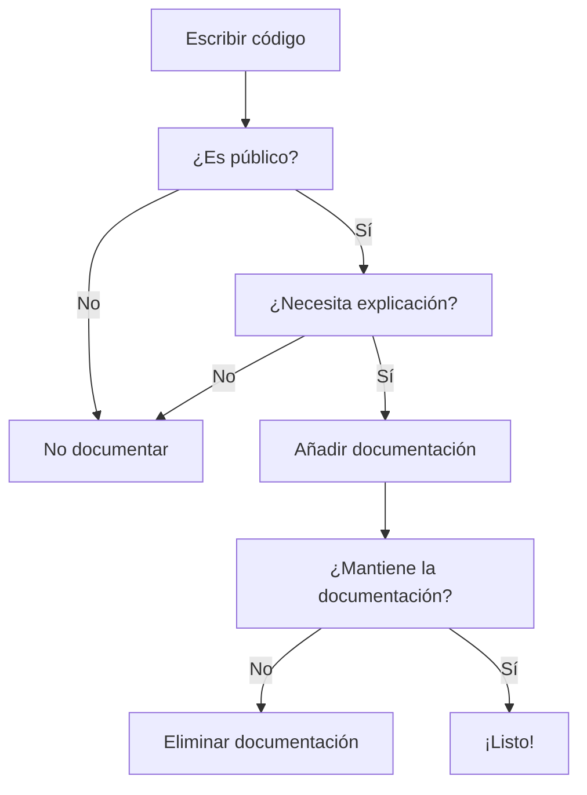

- [5. Documentación de Código](#5-documentación-de-código)
  - [5.1. ¿Por qué Documentar?](#51-por-qué-documentar)
  - [5.2. Markdown](#52-markdown)
    - [¿Por qué Markdown?](#por-qué-markdown)
    - [Sintaxis Básica](#sintaxis-básica)
    - [Ejemplo de README.md Completo](#ejemplo-de-readmemd-completo)
  - [📁 Estructura](#-estructura)
  - [🛠️ Comandos](#️-comandos)
  - [🤝 Contribución](#-contribución)
  - [📄 Licencia](#-licencia)
    - [Etiquetas JavaDoc Comunes](#etiquetas-javadoc-comunes)
    - [Ejemplo Completo](#ejemplo-completo)
  - [5.4. XMLdoc (C#)](#54-xmldoc-c)
    - [Sintaxis de XMLdoc](#sintaxis-de-xmldoc)
    - [Etiquetas XMLdoc Comunes](#etiquetas-xmldoc-comunes)
    - [Ejemplo Completo](#ejemplo-completo-1)
  - [5.5. Comparativa: JavaDoc vs XMLdoc](#55-comparativa-javadoc-vs-xmldoc)
  - [5.6. Buenas Prácticas de Documentación](#56-buenas-prácticas-de-documentación)
    - [✅ Lo que DEBES hacer](#-lo-que-debes-hacer)
    - [❌ Lo que NO debes hacer](#-lo-que-no-debes-hacer)


# 5. Documentación de Código

En este módulo aprenderás la importancia de documentar el código y las herramientas más utilizadas para hacerlo.

---

## 5.1. ¿Por qué Documentar?

La **documentación del código** es fundamental para el mantenimiento futuro de cualquier proyecto.

**Beneficios de la Documentación:**

- **Mantenibilidad**: Otros desarrolladores pueden entender tu código
- **Colaboración**: Facilita el trabajo en equipo
- **Onboarding**: Nuevos miembros entienden el proyecto más rápido
- **Referencia**: Tu yo futuro te lo agradecerá

> 📝 **Nota del Profesor:** "El código bien documentado es como un libro de instrucciones. Sin él, los desarrolladores tendrían que 'adivinar' cómo funciona tu código."

> 💡 **Tip del Examinador:** Pregunta típica: "¿Por qué es importante documentar el código?"
> **Respuesta:** Facilita el mantenimiento, colaboración, onboarding de nuevos desarrolladores y comprensión del código a largo plazo."

---

## 5.2. Markdown

**Markdown** es un lenguaje de marcado ligero diseñado para máxima legibilidad y facilidad de escritura.

### ¿Por qué Markdown?

- Sintaxis sencilla e intuitiva
- Formato por defecto en GitHub (README.md, wikis)
- Portable (texto plano)
- Versatilidad (notas, libros, documentación)

### Sintaxis Básica

```markdown
# Encabezado 1
## Encabezado 2
### Encabezado 3

**Negrita** o __Negrita__
*Cursiva* o _Cursiva_
***Negrita y cursiva***

- Lista con viñetas
1. Lista numerada
  1. Sub-lista indentada

[Enlace](https://ejemplo.com "Título")


`código en línea`

```java
// Bloque de código
public class Hola {
    public static void main(String[] args) {
        System.out.println("Hola Mundo!");
    }
}
```
```

### Tablas

```markdown
| Columna 1 | Columna 2 | Columna 3 |
|-----------|:---------:|----------:|
| Izquierda | Centro    | Derecha   |
| Texto     | 123       | Más texto |
```

### Ejemplo de README.md Completo

```markdown
# Mi Proyecto

Descripción breve del proyecto.

## 🚀 Inicio Rápido

```bash
git clone https://github.com/usuario/proyecto.git
cd proyecto
npm install
npm start
```

## 📁 Estructura

```
src/
├── components/
├── pages/
└── utils/
```

## 🛠️ Comandos

| Comando | Descripción |
|---------|-------------|
| `npm start` | Iniciar servidor |
| `npm test` | Ejecutar tests |

## 🤝 Contribución

1. Fork el proyecto
2. Crea tu rama (`git checkout -b feature/amazing`)
3. Commit (`git commit -m 'Add amazing feature'`)
4. Push (`git push origin feature/amazing`)
5. Abre un Pull Request

## 📄 Licencia

MIT
```

> 📝 **Regla nemotécnica:** "README.md es la tarjeta de presentación de tu proyecto. Debe responder: ¿Qué es? ¿Cómo lo instalo? ¿Cómo lo uso?"

---

## 5.3. JavaDoc (Java)

**Javadoc** genera documentación HTML desde el código fuente Java.

### Sintaxis de JavaDoc

```java
/**
 * Descripción breve de la clase/método.
 * Descripción más detallada si es necesaria.
 *
 * @author Tu Nombre
 * @version 1.0.0
 * @since 2024-01-01
 */
public class MiClase {
    
    /**
     * Descripción del método.
     *
     * @param parametro Descripción del parámetro
     * @return Descripción del valor de retorno
     * @throws Excepcion Descripción de cuándo se lanza
     */
    public tipo metodo(tipo parametro) throws Excepcion {
        // implementación
    }
}
```

### Etiquetas JavaDoc Comunes

| Etiqueta | Descripción | Ejemplo |
|----------|-------------|---------|
| `@author` | Autor del código | `@author Juan Pérez` |
| `@version` | Versión | `@version 1.0.0` |
| `@param` | Parámetro de método | `@param nombre descripción` |
| `@return` | Valor de retorno | `@return el resultado calculado` |
| `@throws` | Excepción posible | `@throws IOException si falla` |
| `@see` | Referencia relacionada | `@seeOtraClase` |
| `@deprecated` | Código obsoleto | `@deprecated usar nuevoMétodo()` |

> 💡 **Regla nemotécnica:** "Las 4 @ del desarrollo JavaDoc son: **@param**, **@return**, **@throws**, **@author**."

### Ejemplo Completo

```java
/**
 * La clase {@code Calculadora} proporciona operaciones matemáticas básicas.
 * Esta clase es inmutable y Thread-safe.
 *
 * @author  José Luis González
 * @version 2.0.0
 * @since   1.0.0
 * @see     Math
 */
public class Calculadora {
    
    /**
     * Constructor por defecto.
     */
    public Calculadora() {
        // Inicialización
    }
    
    /**
     * Suma dos números enteros.
     *
     * @param a El primer número a sumar (no puede ser null)
     * @param b El segundo número a sumar (no puede ser null)
     * @return La suma de {@code a} y {@code b}
     * @throws IllegalArgumentException si algún parámetro es null
     * @example Calculadora.sum(2, 3) returns 5
     */
    public Integer sum(Integer a, Integer b) {
        if (a == null || b == null) {
            throw new IllegalArgumentException("Los parámetros no pueden ser null");
        }
        return a + b;
    }
    
    /**
     * Calcula la división de dos números.
     *
     * @param dividendo El número a dividir
     * @param divisor El número por el que se divide (no puede ser cero)
     * @return El resultado de la división
     * @throws ArithmeticException si el divisor es cero
     */
    public Double divide(Double dividendo, Double divisor) {
        if (divisor == 0) {
            throw new ArithmeticException("No se puede dividir por cero");
        }
        return dividendo / divisor;
    }
}
```

---

## 5.4. XMLdoc (C#)

**XMLdoc** es el mecanismo de C# para documentar código mediante comentarios XML.

### Sintaxis de XMLdoc

```csharp
/// <summary>
/// Descripción breve de la clase/método.
/// </summary>
/// <remarks>
/// Descripción más detallada si es necesaria.
/// </remarks>
public class MiClase
{
    /// <summary>
    /// Descripción del método.
    /// </summary>
    /// <param name="parametro">Descripción del parámetro</param>
    /// <returns>Descripción del valor de retorno</returns>
    /// <exception cref="Excepcion">Descripción de cuándo se lanza</exception>
    public tipo Metodo(tipo parametro)
    {
        // implementación
    }
}
```

### Etiquetas XMLdoc Comunes

| Etiqueta | Descripción | Ejemplo |
|----------|-------------|---------|
| `<summary>` | Descripción breve | `<summary>Calcula el total</summary>` |
| `<param>` | Parámetro | `<param name="x">El valor X</param>` |
| `<returns>` | Valor de retorno | `<returns>El resultado</returns>` |
| `<exception>` | Excepción | `<exception cref="Exception">Si hay error</exception>` |
| `<example>` | Ejemplo de uso | `<example>Calc.Sum(2,3)</example>` |
| `<code>` | Fragmento de código | `<code>int x = 5;</code>` |
| `<see>` | Referencia | `<see cref="Console.WriteLine"/>` |
| `<remarks>` | Notas adicionales | `<remarks>Thread-safe</remarks>` |

### Ejemplo Completo

```csharp
/// <summary>
/// La clase <c>Producto</c> representa un artículo individual en un inventario.
/// Cada producto tiene un identificador único, un nombre, un precio y una cantidad en stock.
/// </summary>
/// <remarks>
/// Esta clase es fundamental para la gestión de inventario y asegura la encapsulación
/// de los detalles del producto.
/// </remarks>
/// <example>
/// <code>
/// Producto p = new Producto("P001", "Laptop", 1200.50, 10);
/// Console.WriteLine(p.Nombre); // Salida: Laptop
/// </code>
/// </example>
public class Producto
{
    /// <summary>
    /// Obtiene el identificador único del producto.
    /// </summary>
    /// <value>Un <see cref="System.String"/> que representa el ID del producto.</value>
    public string Id { get; }

    /// <summary>
    /// Obtiene o establece el nombre del producto.
    /// </summary>
    /// <value>El nombre del producto.</value>
    /// <exception cref="System.ArgumentException">
    /// Se lanza cuando el nombre es nulo o vacío.
    /// </exception>
    public string Nombre
    {
        get => _nombre;
        set
        {
            if (string.IsNullOrWhiteSpace(value))
                throw new ArgumentException("El nombre no puede estar vacío");
            _nombre = value;
        }
    }
    private string _nombre;

    /// <summary>
    /// Obtiene el precio unitario del producto.
    /// </summary>
    /// <value>El precio del producto.</value>
    public decimal Precio { get; }

    /// <summary>
    /// Constructor para crear un nuevo producto.
    /// </summary>
    /// <param name="id">El identificador único del producto.</param>
    /// <param name="nombre">El nombre del producto.</param>
    /// <param name="precio">El precio unitario (debe ser mayor que cero).</param>
    /// <exception cref="System.ArgumentException">
    /// Si el precio es menor o igual a cero.
    /// </exception>
    public Producto(string id, string nombre, decimal precio)
    {
        Id = id ?? throw new ArgumentNullException(nameof(id));
        Nombre = nombre;
        
        if (precio <= 0)
            throw new ArgumentException("El precio debe ser mayor que cero");
        
        Precio = precio;
    }
}
```

---

## 5.5. Comparativa: JavaDoc vs XMLdoc

| Característica | JavaDoc | XMLdoc |
|----------------|---------|--------|
| **Lenguaje** | Java | C# |
| **Símbolo inicio** | `/**` | `///` |
| **Generación** | HTML directo | XML → HTML |
| **Referencia código** | `{@code}` | `<code>` |
| **Enlace miembros** | `{@link}` | `<see>` |

> 💡 **Tip del Examinador:** Pregunta típica: "¿Cómo documentarías un método en Java que suma dos números?"
> **Respuesta:** Usaría Javadoc con `@param`, `@return` y descripción.

```java
/**
 * Suma dos números enteros.
 *
 * @param a El primer número (no puede ser null)
 * @param b El segundo número (no puede ser null)
 * @return La suma de a y b
 * @throws IllegalArgumentException si algún parámetro es null
 */
public int sumar(int a, int b) {
    return a + b;
}
```

---

## 5.6. Buenas Prácticas de Documentación

### ✅ Lo que DEBES hacer

- Documentar clases públicas y métodos
- Explicar el "por qué", no solo el "qué"
- Mantener la documentación actualizada
- Usar comentarios significativos
- Incluir ejemplos de uso

### ❌ Lo que NO debes hacer

- Documentar código obvious
- Dejar código comentado (elimínalo)
- Usar comentarios para "descrédito" (// esto está mal)
- Documentar después (hazlo al escribir)

> 📝 **Regla de oro:** "Comenta el 'por qué', no el 'qué'. El código debería ser auto-explicativo."


