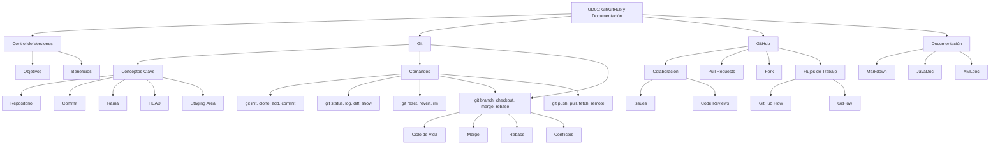

- [6. Resumen y Conclusiones](#6-resumen-y-conclusiones)
  - [6.1. Mapa Conceptual de la Unidad](#61-mapa-conceptual-de-la-unidad)
  - [6.2. Conceptos Clave Detallados](#62-conceptos-clave-detallados)
    - [Git y el Control de Versiones](#git-y-el-control-de-versiones)
    - [Ramas y Fusión](#ramas-y-fusión)
    - [Documentación](#documentación)
  - [6.3. Principios y Buenas Prácticas](#63-principios-y-buenas-prácticas)
    - [Commits Significativos](#commits-significativos)
    - [Ramas Efectivas](#ramas-efectivas)
    - [Documentación Profesional](#documentación-profesional)
  - [6.4. Checklist de Supervivencia](#64-checklist-de-supervivencia)
    - [Git Básico](#git-básico)
    - [Ramas y Fusión](#ramas-y-fusión-1)
    - [GitHub y Colaboración](#github-y-colaboración)
    - [Documentación](#documentación-1)
    - [Comandos Avanzados](#comandos-avanzados)
  - [6.5. Errores Comunes a Evitar](#65-errores-comunes-a-evitar)
  - [6.6. Recursos Adicionales](#66-recursos-adicionales)
    - [Documentación Oficial](#documentación-oficial)
    - [Herramientas](#herramientas)
    - [Cheat Sheets](#cheat-sheets)


# 6. Resumen y Conclusiones

En esta unidad hemos explorado los fundamentos del control de versiones con Git y GitHub, así como la importancia de documentar el código. Estos pilares son esenciales para la eficiencia, calidad y colaboración en el desarrollo de software.

---

## 6.1. Mapa Conceptual de la Unidad



---

## 6.2. Conceptos Clave Detallados

### Git y el Control de Versiones

**¿Qué es Git?**
Git es un sistema de control de versiones distribuido creado por Linus Torvalds en 2005. Cada desarrollador tiene una copia local completa del historial del proyecto.

**Los Tres Estados de Git:**
| Estado | Descripción | Donde está |
|--------|-------------|------------|
| Modificado | Has cambiado el archivo | Working Directory |
| Preparado | Marcado para el próximo commit | Staging Area |
| Confirmado | Guardado permanentemente | Repository |

**Conceptos Fundamentales:**

- **Commit**: Instantánea del proyecto identificada por hash SHA-1
- **Branch**: Línea de desarrollo independiente (puntero a commit)
- **HEAD**: Puntero a la rama/commit actual
- **Remote**: Repositorio en otro ordenador (GitHub)

### Ramas y Fusión

**Comandos de Rama:**
```bash
git branch nombre        # Crear
git checkout nombre      # Cambiar
git branch -d nombre     # Eliminar
git merge nombre         # Fusionar
```

**Merge vs Rebase:**
- **Merge**: Conserva el historial, crea commit de fusión
- **Rebase**: Historial lineal, reescribe commits

**Flujos de Trabajo:**
- **GitHub Flow**: Simple, continuous deployment, una rama main
- **GitFlow**: Estructurado, versiones, ramas develop y release

### Documentación

**Tipos de Documentación:**
| Tipo | Uso | Sintaxis |
|------|-----|----------|
| Markdown | README, documentación general | `#`, `**`, `[](), ``` ` |
| JavaDoc | APIs Java | `/** */`, `@param`, `@return` |
| XMLdoc | APIs C# | `///`, `<summary>`, `<param>` |

---

## 6.3. Principios y Buenas Prácticas

### Commits Significativos

> 📝 **Regla del imperativo:** "Escribe mensajes como órdenes: 'Añadir función' no 'Añadida función'."

**Buen commit:**
```
Añadida validación de email en formulario de registro

- Verifica formato email con regex
- Muestra mensaje de error específico
- Incluye tests unitarios
```

**Estructura del commit:**
- Título: < 50 caracteres
- Cuerpo: Explicación detallada
- Pie: Referencias a issues

### Ramas Efectivas

| Prefijo | Uso | Ejemplo |
|---------|-----|---------|
| `feature/` | Nueva funcionalidad | `feature/login-social` |
| `bugfix/` | Corrección de error | `bugfix/error-500` |
| `hotfix/` | Corrección urgente | `hotfix/security-patch` |
| `release/` | Preparación release | `release/v2.0.0` |

### Documentación Profesional

**Lo que SÍ documentamos:**
- APIs públicas
- Decisiones de diseño complejas
- Workarounds conocidos
- Configuraciones importantes

**Lo que NO documentamos:**
- Código obvious
- Código autodescriptivo
- Código obsoleto (eliminarlo)

---

## 6.4. Checklist de Supervivencia

Antes de dar por cerrada la unidad, asegúrate de poder responder **SÍ** a estas preguntas:

### Git Básico
- [ ] ¿Entiendo la diferencia entre los tres estados de un archivo en Git?
- [ ] ¿Sé usar `git add`, `git commit` y `git push` correctamente?
- [ ] ¿Puedo explicar qué es HEAD y cómo funciona?
- [ ] ¿Sé la diferencia entre `git fetch` y `git pull`?

### Ramas y Fusión
- [ ] ¿Entiendo qué es una rama en Git?
- [ ] ¿Puedo crear, cambiar y eliminar ramas?
- [ ] ¿Sé qué es un merge y cuándo ocurre?
- [ ] ¿Conozco la diferencia entre merge y rebase?
- [ ] ¿Sé qué son los conflictos y cómo resolverlos?

### GitHub y Colaboración
- [ ] ¿Entiendo qué es un Pull Request y para qué sirve?
- [ ] ¿Sé la diferencia entre Fork y Clone?
- [ ] ¿Puedo explicar los dos flujos de trabajo principales (GitHub Flow vs GitFlow)?
- [ ] ¿Sé cómo contribuir a un proyecto de código abierto con Fork?

### Documentación
- [ ] ¿Puedo escribir documentación en Markdown?
- [ ] ¿Sé las diferencias entre JavaDoc y XMLdoc?
- [ ] ¿Conozco las etiquetas más importantes de JavaDoc (`@param`, `@return`, `@throws`)?
- [ ] ¿Entiendo por qué es importante documentar el código?

### Comandos Avanzados
- [ ] ¿Sé usar `git reset` (soft, mixed, hard) y cuándo usar cada uno?
- [ ] ¿Puedo usar `git revert` para deshacer commits publicados?
- [ ] ¿Sé crear y usar `.gitignore` correctamente?
- [ ] ¿Puedo usar `git log` con diferentes formatos?

---

## 6.5. Errores Comunes a Evitar

| Error | Solución |
|-------|----------|
| Commit sin mensaje descriptivo | Usar `git commit -m "título\n\ndescripción"` |
| Hacer commit de archivos no deseados | Usar `git add -p` para seleccionar cambios |
| Perder cambios con `git reset --hard` | Usar `git reflog` para recuperar |
| Merge conflicts sin resolver bien | Revisar ambos cambios antes de resolver |
| Push a rama compartida sin permiso | Verificar rama y permisos antes de push |
| Olvidar sincronizar fork | Hacer `git fetch upstream` regularmente |
| Documentación desactualizada | Actualizar al hacer cambios |

---

## 6.6. Recursos Adicionales

### Documentación Oficial
- [Git](https://git-scm.com/doc)
- [GitHub](https://docs.github.com)
- [GitLab](https://docs.gitlab.com)

### Herramientas
- [Oh My Zsh](https://ohmyz.sh/) - Terminal mejorada
- [GitKraken](https://www.gitkraken.com/) - Cliente GUI
- [VS Code + Git Lens](https://gitkraken.com/) - Editor con Git

### Cheat Sheets
```bash
# Comandos más usados
git init              # Inicializar repo
git clone url         # Clonar repo
git add .             # Preparar cambios
git commit -m "msg"   # Confirmar
git push              # Subir
git pull              # Bajaryfusionar
git status            # Ver estado
git log --oneline     # Ver historial
git branch            # Ver ramas
git checkout -b       # Crear y cambiar
git merge             # Fusionar
```
